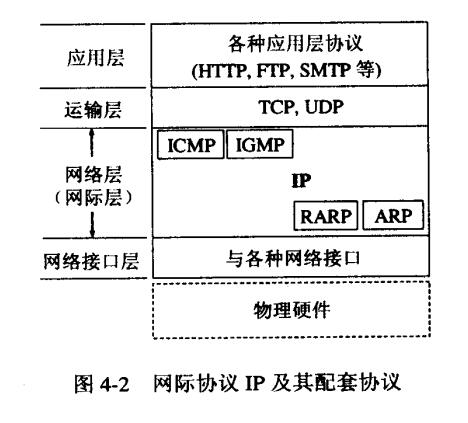
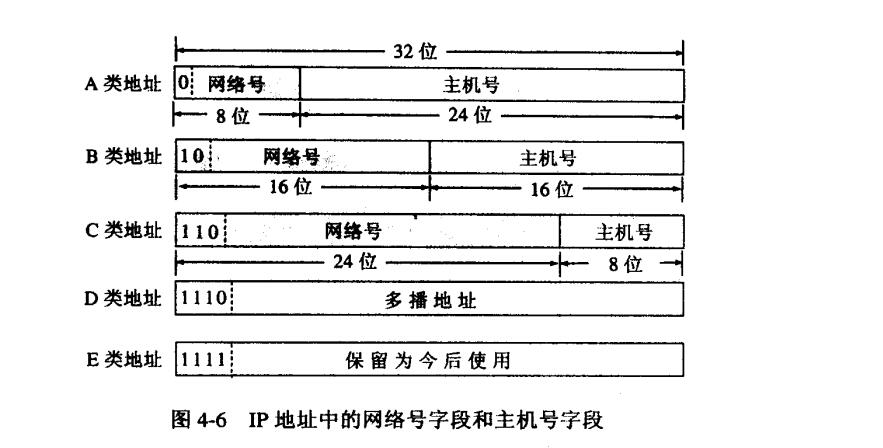

## 网络层
网络层**并没有**采用电信网络一样的虚连接模式，所谓的虚连接模式，就是先在电路中分配一条虚电路virtual circuit，然后数据都基于此电路传输

因特网**实际采用**的设计思路是：网络向上只提供**简单灵活的，无连接的，尽最大努力交互的数据报服务**。

所谓的尽力而为的服务，其实就是无服务的委婉说法。说明网络层不提供确保交付，有序交付，安全交付等机制

### IP协议
网络层的核心协议，与IP协议配套使用的还有如下4个协议

 - 地址解析协议ARP(address resolution protocol)
 - 逆地址解析协议RARP(reverse address resolution protocol)
 - 网际控制报文协议ICMP(Internet Control Message protocol)
 - 网际组管理协议IGMP(Internet Group Management Protocol)

如上图所示，ICMP和IGMP在上面因为他们是基于IP协议，RARP和ARP在IP下面是因为IP经常要使用他们。

### IP地址
ip地址中所周知分为网络号,主机号。

如图所示划分ip地址为5类。

A类，0-128, B类是前缀128-192，C类是192-224，D类是多播地址224-240.E类则是保留使用，位置在240往后。

A类网络中，有特殊的网络号，**全0表示本网络**，**127网络号为环回测试(本机进程之间通信)**。

特殊的主机号也有2个，全0和全1，**全0代表这是本网络，全1代表本网络上的全部主机**。

对于B类网络，128.0.0.0也是不予分配使用的。C类的192.0.0.0网络也是不指配使用。

路由器只根据**网络号**，来转发分组。
