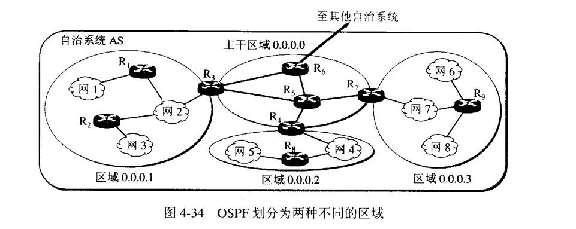
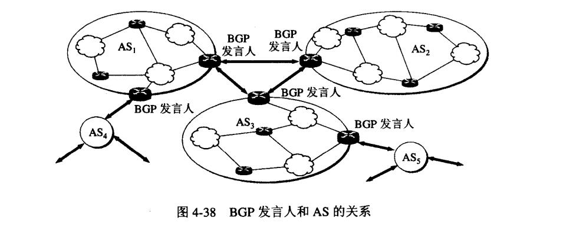
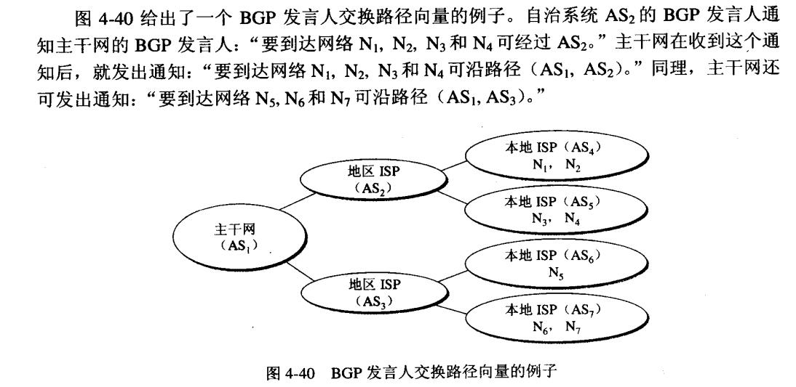

## 路由选路算法
路由算法目的是找到一条从源路由器到目的路由器的好的路径。

路由算法主要可分为**距离向量路由算法Distance Vector Routing Algorithm和链路状态路由算法Link State Routing Algorithm**，分别简称为**DV算法**，和**LS算法**。不过也有第三种，分层路由(hierarchical routing)，用于区域间选路。

除此之外，我们知道在目前因特网中，一个大的ISP就是一个**自治系统autonomous system-简称AS**，按照自治系统管理来区分，路由算法也可以分成两大类。

 - 内部网关协议IGP(Interior Gateway Protocol),即在一个自治系统内部使用的路由选择协议。目前这类系统使用得最多的是**RIP**和**OSPF**。
 - 外部网关协议EGP(External Gateway Protocol) 若源主机和目的主机处在不同的自治系统中，数据报传输到边界时，就需要使用一种协议将路由信息传递到另一个自治系统中，目前用的最多的是**BGP-4**

### 路由信息协议RIP
**路由信息协议RIP,Routing Information Protocol**,是IGP中最先广泛使用的协议，RIP是一种**分布式的距离向量路由选择协议**，也就是**基于DV算法**。

DV算法是基于Bellman - ford算法的，对于Bellman-Ford算法可以看算法相关笔记。

RIP协议是应用层协议，基于UDP。

#### 距离向量
每一个路由器都要维护自己到每个目的网络的距离，这样**一组距离就被称为距离向量**。

距离定义为
 - 直连网络距离定义为1
 - 非直连网络为经过的路由器数+1

也就是直连为1，然后每经过一个路由器就距离加1.距离也称为**跳数hop count**。RIP最多允许一条路径包含15个路由器，所以需要注意了，**距离大于等于16时相当于不可达**。

因此可见，**RIP比较适用于小型互联网**。

#### 信息交换
路由器仅和相邻(直连)的路由器交换信息，交换的内容是**当前路由器已知的到其他所有网络的最短距离,以及下一跳是谁**。

然后按照固定时间间隔交换路由信息，每当拓扑变化时，通告变化。

RIP刚开始工作时，每个路由器信息很少，但是经过一段时间各个路由器通告信息的**收敛**，每个路由器都能得到比较正确的信息。

当然，如果某一个链路180s没收到通告信息，那么那条链路会被标记为不可达。
#### 简要过程
因此RIP根据上述原理更新路由表，当收到比如路由器X的RIP报文时候，检查X到其他网络的路由条目，距离+1之后跟自己的路由表做对比，看看哪个更短，如果X那边的距离+1更短，那就更新自己的路由表，并将下一跳设置为X。

经过一段时间的收敛，很快每个路由器都能算出最短距离。

### 开放路径优先协议OSPF
**开放路径优先协议OSPF,Open Shortest Path First**，是为了克服RIP的缺点开发出来的。

OSPF是一个**分布式的链路状态(link state protocol)协议**，也就是所谓的**基于LS算法**。

而LS算法，其实是**基于Dijkstra最短路算法的**。

#### 信息交换

**路由器使用泛洪法(flooding)向同自治系统(比如同一个ISP下)所有的路由器发送信息**。而且，只在链路状态**发生变化**的时候才泛洪信息。

发送的信息内容是与本路由器相邻的所有路由器的链路状态。所谓的链路状态就是，本路由器和哪些路由器相邻，该链路的metric(度量)是多少。

**zwlj:这样进行链路状态交换的目的是,构建一个全局的拓扑结构图。当我们拿到了这个全局的结构图以后，我们就能在每个节点利用Dijkstra最短路算法得出最短metric路线**

所有的路由器最终都能建立一个链路状态数据库(link-state database),这个拓扑结构图全网范围内一致。因此每个路由器都知道全网有多少个路由器，如何相连，代价为多少。即**每个路由器都有全局图**。

**由此可知，OSPF收敛很快，并且很适合大规模网络。**

#### 区域划分
为了OSPF更好的应用于大规模网络，OSPF可以将一个自治系统划分成若干个小区域(area),每个区域可以有一个32位标识符。

如上图，区域划分的好处就是泛洪交换的范围局限在了一个区域，而不是整个自治系统。

这里要注意，划分的区域中要有一个主干区域并命名为0.0.0.0，这个区域用来联通自治系统外部和内部的各个区域。如上图。并且类似R3,R7这样的路由器，是**区域边界路由器area border router**负责打通区域。主干区域里当然有R6这种，自治系统边界路由器，用来交换自治系统外界的信息。

#### 先进特性
相比于RIP，OSPF

 - 更安全，OSPF信息需要认证
 - 允许存在等权值多条最短路，RIP只能一条
 - 对于每一条链路，可以自由设置权值。
 - 支持多播
 - 大区域内可以进行ospf分层

### 分层路由(hierarchical routing)概念
可以看到，在LS和DV算法中，每个路由器都需要保存其他路由器的一些信息。随着网络规模的扩大，网络中的路由器也将增加。因此，路由表的规模也将增大，从而使路由器不能有效地处理网络流量。使用分级路由可以解决这个问题。

将路由器分成不同的区域，每个区域采用合适的路由算法，比如DV的RIP算法

在分级路由中，路由器被分成很多组，称为区域。每个路由器都只有自己所在区域路由器的信息，而没有其他区域路由器的信息。所以在其路由表中，路由器只需要存储其他每个区域的一条记录。在这个例子中，我们将网络分为5个区域。

如果A想发送分组数据包到在区域2中的一个路由器（D、E、F或G），它就将分组数据包先发送到B，依此类推。可以看到，在这种类型的路由中，**可以对路由表进行概括**，因此网络效率提高了。上面的例子描述了一个两级的分级路由。同样我们也可以采用三级或者四级的分级路由。

在一个三级的分级路由中，网络被分为很多簇。每个簇由很多个区域组成，每个区域包含很多个路由器。分级路由广泛应用于互联网路由中，并且使用了多种路由协议。

### 边界网关协议BGP
**BGP/BGP4：Border Gateway Protocol，边界网关协议**，提供了一套新的机制以支持无类域间路由。这是用于不同AS之间的交换路由协议。

BGP**力求找一条比较好的路由，而不是最佳路由**。

BGP要求，在一个区域内，要选出一个BGP发言人，一般选择BGP边界路由器(也可以不是)。**不同AS发言人之间通过TCP连接(端口179)，进行BGP回话**。可见BGP协议建立在TCP之上。交换信息的两个发言人彼此成为对方的**邻站neighbor**或者**对等站peer**

#### 信息交换
BGP交换信息不再基于路由器，而是基于整个区域，AS系统。

发言人之间交换的就是网络的可达性信息，比如去往某个网络要经过的一系列AS。BGP发言人根据所采用的策略从收到的路由信息中找出到达AS的较好路由。构造出的是**树形结构图**，不存在回路。

BGP发言人通告路径向量例子如下

并且BGP允许子网宣告全网它的存在。

注意通告的信息里，有两方面
 - AS-PATH,到达目的地要通过哪些AS，比如“AS1 AS2 ....” 列出所有经过的AS
 - NEXT-HOP 相当于as里的吓一跳，也就是要**通过哪个边界路由器出去**。

在进行路由选择的时候，经常选用**热土豆路由选择**。Baran 在1964年提出的热土豆（Hot Potato）算法。当一个分组到来时，节点必须尽快脱手，将其放入输出**列最短**的方向上排队，而不管该方向通向何方。
