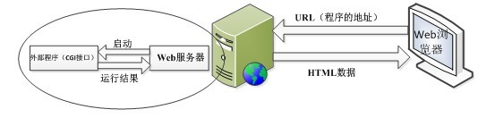
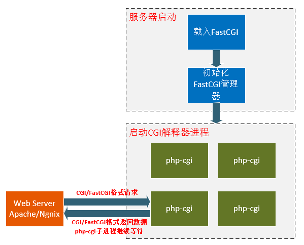

## CGI
通用网关接口（Common Gateway Interface/CGI）是一种重要的互联网技术，可以让一个客户端，从网页浏览器向执行在网络服务器上的程序请求数据。**CGI描述了服务器和请求处理程序之间传输数据的一种标准。**

CGI不是一门编程语言。它是**网页的表单(或者说数据)和你写的程序之间通信的一种协议**。可以用任何语言写一个CGI脚本，这些语言只要能接收输入输出信息，读取环境变量。所以，几乎所有的编程语言都能写一个CGI脚本，例如：python

Common Gateway Interface，简称CGI。CGI程序在物理上是一段程序，运行在服务器上，提供同客户端HTML页面的接口。

**zwlj:也就是说CGI程序用来处理用户提交的数据并返回HTML页面。且CGI指的是协议！这个很重要！！**



也就是说CGI程序只是处理数据，web服务器进程则负责进行通信。当客户端有请求来时，web服务器将调用cgi程序处理请求数据，然后得出数据后返回给客户端。

### 遵循CGI标准的脚本结构
典型的CGI脚本做了如下的事情：
1. 通过Internet把用户请求送到web服务器。
2. web服务器接收用户请求并交给CGI程序处理。
3. CGI程序把处理结果传送给web服务器。
4. web服务器把结果送回到用户。

### 工作原理
每当客户请求CGI的时候，WEB服务器就请求操作系统**生成一个新的CGI解释器进程(如php-cgi.exe)，CGI 的一个进程则处理完一个请求后退出，下一个请求来时再创建新进程**。当然，这样在访问量很少没有并发的情况也行。可是当访问量增大，并发存在，这种方式就不适合。

### fastcgi
从功能上来讲，CGI 协议已经完全能够解决 Web 服务器与 Web 应用之间的数据通信问题。但是由于每个请求都需要重新 fork 出 CGI 子进程导致性能堪忧，所以基于 CGI 协议的基础上做了改进便有了 FastCGI 协议，它是一种常驻型的 CGI 协议。

CGI 协议每次接收到 HTTP 请求时，都需要经历 fork 出 CGI 子进程、执行处理并销毁 CGI 子进程这一系列工作。而 FastCGI 协议采用 进程间通信(IPC) 来处理用户的请求，下面我们就来看看它的运行原理。



fastcgi其实就是一个通信协议，而fastcgi进程，其实本质上就是根据这个协议写成的fastcgi管理器。就是上图服务器那个部分，Fastcgi管理器会创建出一系列cgi进程用来处理cgi请求。相比于CGI，这就大大提高了效率。

所以当我们说用Fastcgi的时候，其实是指用了这个模式，也就是请求被转发到一个Fastcgi管理器(一个进程),这个进程用来做请求分发给几个cgi处理进程。

#### spwan fcgi
nginx 不能像apache那样直接执行外部可执行程序，但nginx可以作为代理服务器，将请求转发给后端服务器，这也是nginx的主要作用之一。其中nginx就支持FastCGI代理，接收客户端的请求，然后将请求转发给后端fastcgi进程。

spawn-fcgi是一个通用的FastCGI进程管理器，简单小巧，原先是属于lighttpd的一部分，后来由于使用比较广泛，所以就迁移出来作为独立项目了。spawn-fcgi使用pre-fork 模型，功能主要是打开监听端口，绑定地址，然后fork-and-exec创建我们编写的fastcgi应用程序进程，退出完成工作。fastcgi应用程序初始化，然后进入死循环侦听socket的连接请求。

spawn-fcgi则可以指定各种参数信息：

```
-f <fcgiapp> 指定调用FastCGI的进程的执行程序位置

-a <addr> 绑定到地址addr。

-p <port> 绑定到端口port。

-s <path> 绑定到unix domain socket

-C <childs> 指定产生的FastCGI的进程数，默认为5。（仅用于PHP）

-P <path> 指定产生的进程的PID文件路径。

-F <childs> 指定产生的FastCGI的进程数（C的CGI用这个）

-u和-g FastCGI使用什么身份（-u 用户 -g 用户组）运行，CentOS下可以使用apache用户，其他的根据情况配置，如nobody、www-data等。
```

#### 用C编写fastcgi程序
FastCGI软件开发套件：fcgi_stdio 和 fcgiapp，在你的程序中必须包含这些包中的一个

 - fcgi_stdio.h 
 - fcgiapp.h

 fcgi_stdio包，是fcgiapp包的顶层包，在转化CGI程序或者是写新的FastCGI程序是，强烈推荐你用它

FastCGI的代码构成，把你的代码分成两个独立部分：

1．初始化部分：只执行一次
2．应答循环部分：FastCGI脚本每被调用一次，这部分九被执行一次

一个应答循环的典型格式如下：

```
while (FCGI_Accept() >= 0) {//循环条件
　　# 应答循环体
}
```

FCGI_Accept()会**阻塞**，直到一个客户端请求来的时候FCGI_Accept块才执行，并返回0。如果有一个系统故障，或是系统管理员终止进程，Accept将返回-1。

如果应用程序作为一个CGI程序被调用，那么第一次调用Accept时，返回0，第二次总是返回-1，产生CGI行为。

[fastcgi文档](http://doc.mawan.de/libfcgi0ldbl/fastcgi-prog-guide/ch2c.htm)