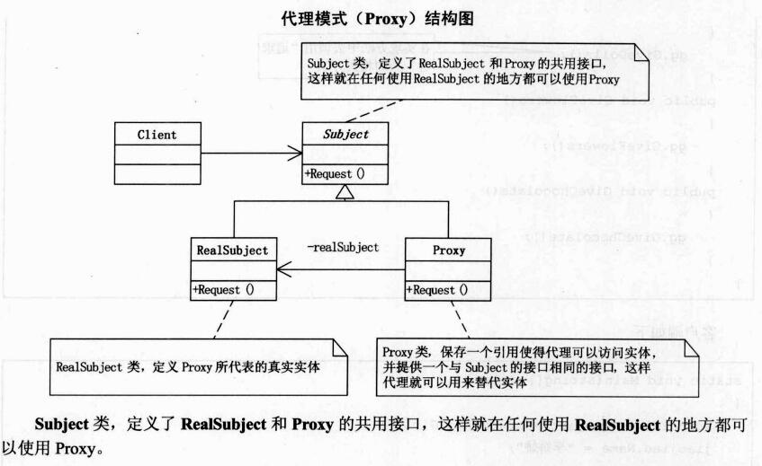

## 代理模式




如图即为设计模式的结构图

### Subject类

Subject类为抽象角色(接口)，里面抽象出角色的一些功能。

### RealSubject
Subject类的具体实现，为真实对象。具体实现了接口的方法。

### Proxy类
代理角色类。注意这个类同样也实现了Subject接口，目的就是为了在某些情况代替RealSubject这个真实角色类来处理某些问题，这就是做代理了。同时，注意到结构图里面Proxy指向RealSubject类的箭头，是指Proxy以组合的方式，持有RealSubject类的一个引用，这样可以在对应的接口方法里调用RealSubject类的具体实现方法。

### 使用场景
当我们需要使用的对象很复杂或者需要很长时间去构造，这时就可以使用代理模式(Proxy)。例如：如果构建一个对象很耗费时间和计算机资源，代理模式(Proxy)允许我们控制这种情况，直到我们需要使用实际的对象。一个代理(Proxy)通常包含和将要使用的对象同样的方法，一旦开始使用这个对象，这些方法将通过代理(Proxy)传递给实际的对象。

使用代理模式，我们还可以对真实对象的行为进行包装，使得扩展性更强。事实上AOP技术，正是用到了这一点。

比如xxxProxy类里有这样的方法。

``` java
public void action(){

  doSomethingBefore();
  realObject.action();
  doSomethingAfter();
}

```

上面代码实例我们就可以看到，除了代理了真实对象以外，我们还可以进行一些自己的操作。

### 优点
 1. 职责清晰,真实的角色就是实现实际的业务逻辑，不用关心其他非本职责的事务，通过后期的代理完成一件完成事务，附带的结果就是编程简洁清晰。
 2. 代理对象可以在客户端和目标对象之间起到中介的作用，这样起到了中介的作用和保护了目标对象的作用。
 3. 高扩展性


### 动态代理
上面所提到的UML的简单实现，实际上，只是**静态代理**。

代理的实现分为：

 - 静态代理：代理类是在编译时就实现好的。也就是说 Java 编译完成后代理类是一个实际的 class 文件。

 - 动态代理：代理类是在运行时生成的。也就是说 Java 编译完之后并没有实际的 class 文件，而是在运行时动态生成的类字节码，并加载到JVM中。

也就是说，当我们真实类是aaa类，然后我们手动写死了一个aaaProxy类，然后我们用这个aaaProxy类做代理，那这就是写死了一个aaaProxy.class文件，这是静态代理。

java1.5以后，提供了java.lang.Proxy类来实现动态代理。这就是**jdk动态代理**。具体可见java jdk相关笔记，这个类可以帮助你再程序运行得过程中动态为xxx类创建其代理xxxProxy类。

jdk动态代理很好，但是也有一个缺陷，就是如果想代理一个没有实现任何接口的类，它就没有用武之处了。所以还有一种动态代理的方式，那便是CGLibProxy，**CGlib动态代理**。详细可看cglib的笔记
