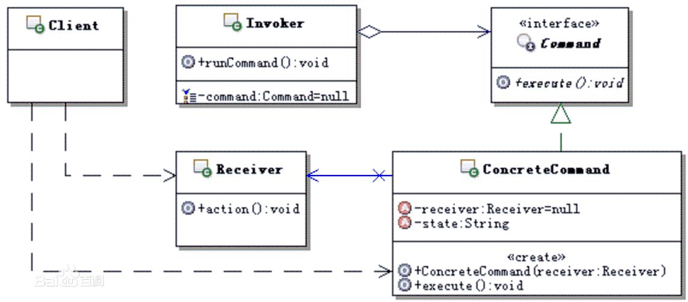

## 命令模式




在软件设计中，我们经常需要向某些对象发送请求，但是并不知道请求的接收者是谁，也不知道被请求的操作是哪个，我们只需在程序运行时指定具体的请求接收者即可，此时，可以使用命令模式来进行设计，使得请求发送者与请求接收者消除彼此之间的耦合，让对象之间的调用关系更加灵活。

由类图可知，命令模式抽象出Command类，专门封装命令，这个类里还会有特定的具体接受者用于执行具体的命令。Client创建Command类并传入具体的接受者，Invoker类（**比如遥控器**）负责执行Command对象。也就是说，Command类只把excucute方法暴露出来让Invoker类执行。

同时撤销命令也可以实现，在Command类里实现undo方法，并且在Invoker中保存之前的Command类。


时序图如下


代码如下
``` c++
#include <iostream>
#include "ConcreteCommand.h"
#include "Invoker.h"
#include "Receiver.h"

using namespace std;

int main(int argc, char *argv[])
{
	Receiver * pReceiver = new Receiver();
	ConcreteCommand * pCommand = new ConcreteCommand(pReceiver);
	Invoker * pInvoker = new Invoker(pCommand);
	pInvoker->call();
	
	delete pReceiver;
	delete pCommand;
	delete pInvoker;
	return 0;
}
```

>
1. 命令模式的本质是对命令进行封装，将发出命令的责任和执行命令的责任分割开。
2. 每一个命令都是一个操作：请求的一方发出请求，要求执行一个操作；接收的一方收到请求，并执行操作。
3. 命令模式允许请求的一方和接收的一方独立开来，使得请求的一方不必知道接收请求的一方的接口，更不必知道请求是怎么被接收，以及操作是否被执行、何时被执行，以及是怎么被执行的。
4. 命令模式使请求本身成为一个对象，这个对象和其他对象一样可以被存储和传递。
5. 命令模式的关键在于引入了抽象命令接口，且发送者针对抽象命令接口编程，只有实现了抽象命令接口的具体命令才能与接收者相关联。

### 模式优点
1. 降低对象之间的耦合度。
2. 新的命令可以很容易地加入到系统中。
3. 可以比较容易地设计一个组合命令。
4. 调用同一方法实现不同的功能
5. 可以实现undo和redo

### 模式缺点
使用命令模式可能会导致某些系统有过多的具体命令类。因为针对每一个命令都需要设计一个具体命令类，因此某些系统可能需要大量具体命令类，这将影响命令模式的使用。

### 适用环境
1. 系统需要将请求调用者和请求接收者解耦，使得调用者和接收者不直接交互。
2. 系统需要在不同的时间指定请求、将请求排队和执行请求。
3. 系统需要支持命令的撤销(Undo)操作和恢复(Redo)操作。
4. 系统需要将一组操作组合在一起，即支持宏命令。