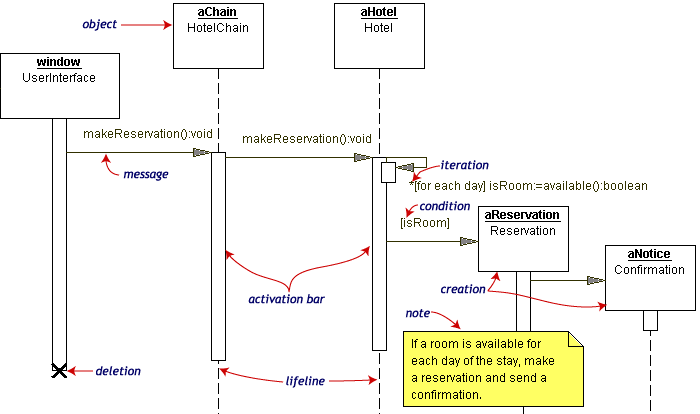
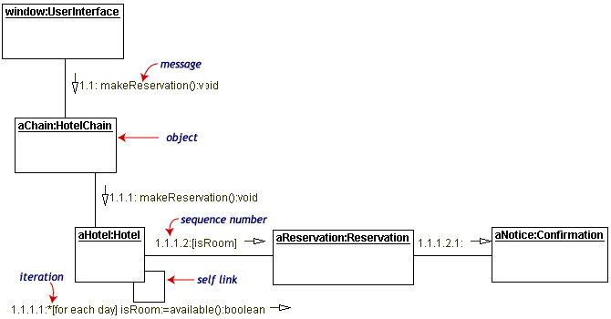
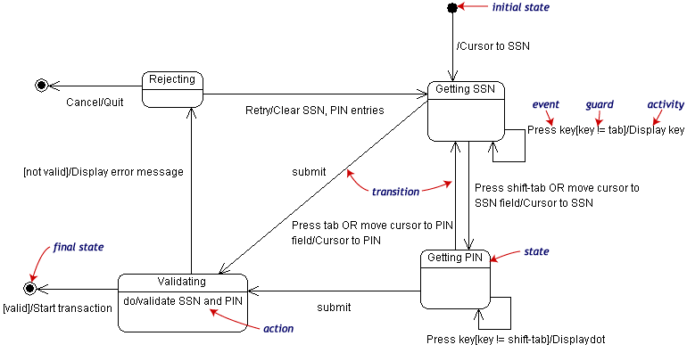

## uml概述
UML 作为一种模型语言，它使开发人员专注于建立产品的模型和结构，而不是选用什么程序语言和算法实现

UML 的目标就是 UML 被定义为一个简单的建模机制，帮助我们按照实际情况或者按照我们需要的样式对系统进行可视化；提供一种详细说明系统的结构或行为的方法；给出一个指导系统构造的模板；对我们所做出的决策进行文档化。

UML支持一下9中建图模型。

 - 用例图(Use case diagram)
 - 类图(Class diagram)
 - 对象图(Object diagram)--COMET没有使用该图
 - 顺序图(Sequence diagram)
 - 协作图(Communication diagram)
 - 状态机图(State Machine diagram)
 - 活动图(Activity diagram)
 - 组件图(Component diagram)
 - 配置图(deployment diagram)

### 用例图(Use case diagram)
用例图描述了系统提供的一个功能单元。用例图的主要目的是帮助开发团队以一种可视化的方式理解系统的功能需求

也就是说用例图Use case diagrams描述了作为一个外部的观察者的视角对系统的印象。强调这个系统是什么而不是这个系统怎么工作。

用例图与**情节(Scenario)** 紧紧相关的。**情节scenario**是指当某个**角色actor**与系统进行互动时发生的情况。下面是一个医院门诊部的情节。

“一个病人打电话给门诊部预约一年一次的身体检查。接待员找出在预约记录本上找出最近的没有预约过的时间，并记上那个时间的预约记录。”

**用例Use case是为了完成一个工作或者达到一个目的的一系列情节的总和**。 **角色actor**是发动与这个工作有关的事件的人或者事情。角色简单的扮演着人或者对象的作用。

下面的图是一个门诊部Make Appointment用例。角色是病人。角色与用例的联系是通讯联系communication association（或简称通讯communication）

actor Patient完成一个Make Appointement功能的用例图

**角色是人状的图标，用例是一个椭圆，通讯是连接角色和用例的线。**

而**一个用例图是角色，用例，和它们之间的联系的集合**。我们已经把Make Appointment作为一个含有四个角色和四个用例的图的一部分。注意一个单独的用例可以有多个角色。

即可知一个用例(Use case),包含了一系列情景。

用例图在三个领域很有作用。

 - 决定特征（需求）。当系统已经分析好并且设计成型时，新的用例产生新的需求
 - 客户通讯。使用用例图很容易表示开发者与客户之间的联系。
 - 产生测试用例。一个用例的情节可能产生这些情节的一批测试用例。

### 类图(class diagram)

类图Class diagram通过显示出系统的类以及这些类之间的关系来表示系统。类图是静态的－它们显示出什么可以产生影响但不会告诉你什么时候产生影响。

下面是一个顾客从零售商处预定商品的模型的类图。中心的类是Order。连接它的是购买货物的Customer和Payment。Payment有三种形式：Cash，Check，或者Credit。订单包括OrderDetails（line item），每个这种类都连着Item。

**UML类的符号是一个被划分成三块的方框：类名，属性，和操作。抽象类的名字，像Payment是斜体的。类之间的关系是连接线。**

类图有**三种关系**。

 - 关联association－表示两种类的实例间的关系。如果一个类的实例必须要用另一个类的实例才能完成工作时就要用关联。在图中，关联用两个类之间的连线表示。

 - 聚合aggregation－当一个类**属于一个容器**的一种特殊关系。**聚合用一个带菱形的连线**，菱形指向具有整体性质的类。在我们的图里，Order是OrderDetails的容器。

 - 泛化generalization－一个指向以其他类作为超类的继承连线。**泛化关系用一个三角形指向超类**。Payment是Cash，Check和Credit的超类。

一个关联有两个尾端。每个尾端可以有一个角色名role name来说明关联的作用。比如，一个OrderDetail实例是一个Order实例的项目line item。

关联上的**方向性navigability箭头**表示该关联传递或查询的方向。OrderDetail类可以查询他的Item，但不可以反过来查询。箭头方向同 样可以告诉你哪个类拥有这个关联的实现；也就是，OrderDetail拥有Item。没有方向性的箭头的关联是双向。

关联尾端的数字表示该关联另一边的一个实例可以对应的数字端的实例的格数，通过这种方式表达**关联的多样性multiplicity**。多样性的数字可以是一个单独的数字或者是一个数字的范围。在例子中，每个Order只有一个Customer，但一个Customer可以有任意多个Order。

UML中实例名带有下划线。只要意思清楚，类或实例名可以在对象图中被省略。

#### 几种关系深化

##### 继承

##### 实现

指的是一个class类实现interface接口（可以是多个）的功能

##### 依赖
就是一个类A使用到了另一个类B,表现在代码层面，为类B作为参数被类A在某个method方法中使用

##### 关联(association)
他体现的是两个类、或者类与接口之间语义级别的一种强依赖关系.表现在代码层面，为被关联类B以类属性的形式出现在关联类A中，也可能是关联类A引用了一个类型为被关联类B的全局变量；

##### 聚合
聚合是关联关系的一种特例，他体现的是整体与部分、拥有的关系，即has-a的关系，此时整体与部分之间是可分离的，他们可以具有各自的生命周期，部分可以属于多个整体对象，也可以为多个整体对象共享；比如计算机与CPU、公司与员工的关系等；表现在代码层面，和关联关系是一致的，只能从语义级别来区分；

##### 组合
组合也是关联关系的一种特例，他体现的是一种contains-a的关系，这种关系比聚合更强，也称为强聚合；他同样体现整体与部分间的关系，但此时整体与部分是不可分的，整体的生命周期结束也就意味着部分的生命周期结束；比如你和你的大脑；表现在代码层面，和关联关系是一致的，只能从语义级别来区分

#### 包(package)
为了简单地表示出复杂的类图，可以把类组合成包packages。一个包是UML上有逻辑关系的元件的集合。

包是用一个在上方带有小标签的矩形表示的。包名写在标签上或者在矩形里面。点化线箭头表示依赖

### 顺序图(Sequence diagram)

顺序图将交互关系表示为一个二维图。纵向是时间轴，时间沿竖线向下延伸。横向轴代表了在协作中各独立对象的类元角色。类元角色用生命线(lifeline)表示,生命线也就是垂直虚线。

每条生命线也可以使用双实线表示**对象正在执行**的时间。

下面是个复杂点的示例

### 协作图/通信图(collaboration diagram/communication diagram)

通信图在UML1.x中被称为协作图。

协作图也是互动的图表。他们像序列图一样也传递相同的信息，但他们不关心什么时候消息被传递，只关心对象的角色。

对象角色矩形上标有类或对象名（或者都有）。类名前面有个冒号（：）。

协作图的每个消息都有一个序列号。顶层消息的数字是1。同一个等级的消息（也就是同一个调用中的消息）有同样的数字前缀，再根据他们出现的顺序增加一个后缀1，2等等。

### 状态图(statechart diagram)
UML表示法中，状态转换图被称为状态机图。

对象拥有行为和状态。对象的状态是由对象当前的行动和条件决定的。状态图statechart diagram显示出了对象可能的状态以及由状态改变而导致的转移。

我们的模型例图建立了一个银行的在线登录系统。登录过程包括输入合法的密码和个人账号，再提交给系统验证信息。

登录系统可以被划分为四种不重叠的状态：Getting SSN, Getting PIN, Validating, 以及 Rejecting。每个状态都有一套完整的转移transitions来决定状态的顺序。

**状态是用圆角矩形来表示的。转移则是使用带箭头的连线表示。触发转移的事件或者条件写在箭头的旁边,初始状态是小黑圈，终结状态是大白圈里的小黑圈。**。我们的图上有两个自转移。一个是在Getting SSN，另一个则在上Getting PIN。

事件或条件触发动作时用（/动作）表示。当进入Validating状态时，对象并不等外部事件触发转移。取而代之，它产生一个动作。动作的结果决定了下一步的状态。
