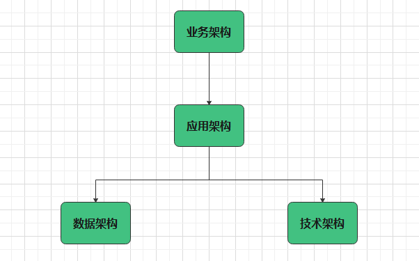
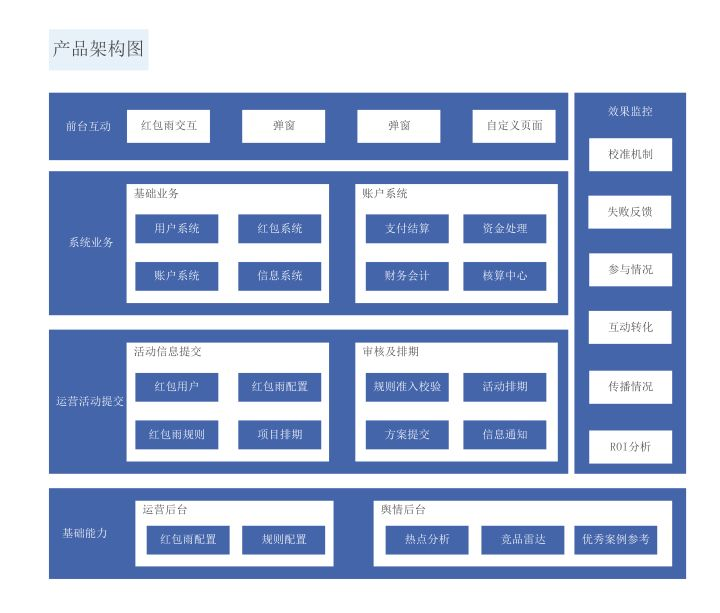
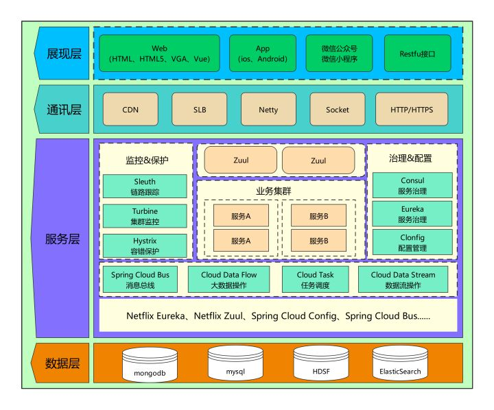
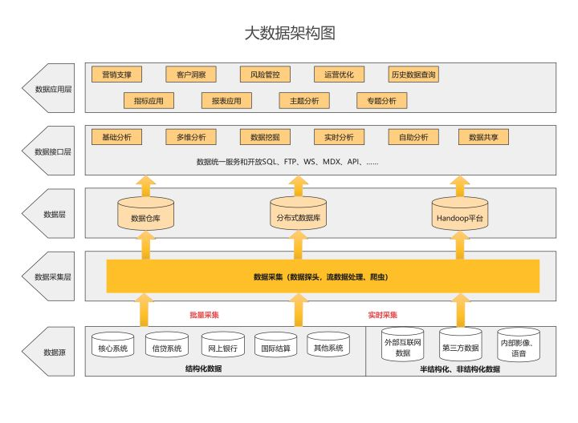

## 架构图设计

架构大致可以分为4类：**业务架构、应用架构、数据架构和技术架构**，整体逻辑关系如下

### 业务架构

**业务架构**：使用一套方法论/逻辑对产品（项目）所涉及到的业务进行边界划分。所以熟悉业务是关键。

比如做一个团购网站，你需要把商品类目、商品、订单、订单服务、支付、退款等进行清晰划分，而业务架构不需要考虑诸如我用什么技术开发、我的并发大怎么办、我选择什么样的硬件等等

### 应用架构

**应用架构**：它是对整个系统实现的总体上的架构，需要指出系统的层次、系统开发的原则、系统各个层次的应用服务。

例如，下图就将系统分为数据层、服务层、通讯层、展现层，并细分写明每个层次的应用服务。

### 数据架构

**数据架构**：是一套对存储数据的架构逻辑，它会根据各个系统应用场景、不同时间段的应用场场景 ，对数据进行诸如数据异构、读写分离、缓存使用、分布式数据策略等划分。

数据架构主要解决三个问题：第一，系统需要什么样的数据；第二，如何存储这些数据；第三，如何进行数据架构设计。

