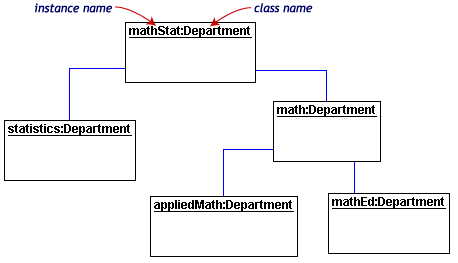
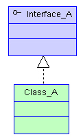

### 类图(class diagram)

类图Class diagram通过显示出系统的类以及这些类之间的关系来表示系统。类图是静态的－它们显示出什么可以产生影响但不会告诉你什么时候产生影响。

下面是一个顾客从零售商处预定商品的模型的类图。中心的类是Order。连接它的是购买货物的Customer和Payment。Payment有三种形式：Cash，Check，或者Credit。订单包括OrderDetails（line item），每个这种类都连着Item。

**UML类的符号是一个被划分成三块的方框：类名，属性，和操作。抽象类的名字，像Payment是斜体的。类之间的关系是连接线。**

类图有**三种关系**。

 - 关联association－表示两种类的实例间的关系。如果一个类的实例必须要用另一个类的实例才能完成工作时就要用关联。在图中，关联用两个类之间的连线表示。

 - 聚合aggregation－当一个类**属于一个容器**的一种特殊关系。**聚合用一个带菱形的连线**，菱形指向具有整体性质的类。在我们的图里，Order是OrderDetails的容器。

 - 泛化generalization－一个指向以其他类作为超类的继承连线。**泛化关系用一个三角形指向超类**。Payment是Cash，Check和Credit的超类。

一个关联有两个尾端。每个尾端可以有一个角色名role name来说明关联的作用。比如，一个OrderDetail实例是一个Order实例的项目line item。

关联上的**方向性navigability箭头**表示该关联传递或查询的方向。OrderDetail类可以查询他的Item，但不可以反过来查询。箭头方向同 样可以告诉你哪个类拥有这个关联的实现；也就是，OrderDetail拥有Item。没有方向性的箭头的关联是双向。

关联尾端的数字表示该关联另一边的一个实例可以对应的数字端的实例的格数，通过这种方式表达**关联的多样性multiplicity**。多样性的数字可以是一个单独的数字或者是一个数字的范围。在例子中，每个Order只有一个Customer，但一个Customer可以有任意多个Order。

UML中实例名带有下划线。只要意思清楚，类或实例名可以在对象图中被省略。

#### 几种关系深化

##### 继承

##### 实现

指的是一个class类实现interface接口（可以是多个）的功能

##### 依赖
就是一个类A使用到了另一个类B,表现在代码层面，为类B作为参数被类A在某个method方法中使用

##### 关联(association)
他体现的是两个类、或者类与接口之间语义级别的一种强依赖关系.表现在代码层面，为被关联类B以类属性的形式出现在关联类A中，也可能是关联类A引用了一个类型为被关联类B的全局变量；

##### 聚合
聚合是关联关系的一种特例，他体现的是整体与部分、拥有的关系，即has-a的关系，此时整体与部分之间是可分离的，他们可以具有各自的生命周期，部分可以属于多个整体对象，也可以为多个整体对象共享；比如计算机与CPU、公司与员工的关系等；表现在代码层面，和关联关系是一致的，只能从语义级别来区分；

shared aggregation is pure aggregation

##### 组合
组合也是关联关系的一种特例，他体现的是一种contains-a的关系，这种关系比聚合更强，也称为强聚合；他同样体现整体与部分间的关系，但此时整体与部分是不可分的，整体的生命周期结束也就意味着部分的生命周期结束；比如你和你的大脑；表现在代码层面，和关联关系是一致的，只能从语义级别来区分

cmposition aggregation

#### 包(package)
为了简单地表示出复杂的类图，可以把类组合成包packages。一个包是UML上有逻辑关系的元件的集合。

包是用一个在上方带有小标签的矩形表示的。包名写在标签上或者在矩形里面。点化线箭头表示依赖

