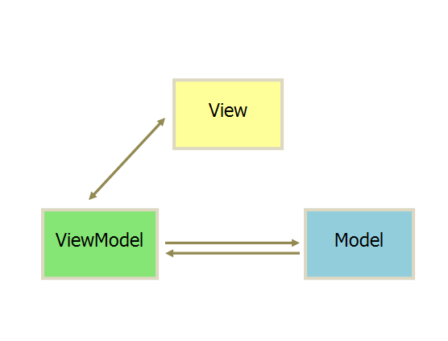

## MVC架构
MVC模式的意思是，软件可以分成三个部分。

 - 视图（View）：用户界面。
 - 控制器（Controller）：业务逻辑
 - 模型（Model）：数据保存

 - View 传送指令到 Controller
 - Controller 完成业务逻辑后，要求 Model 改变状态
 - Model 将新的数据发送到 View，用户得到反馈

通信基本上是单向的。

现在标准MVC架构，其实原作者都说不太清，但基本都符合上面的模式。

### 灵活的实例Backbone
实际项目往往采用更灵活的方式，以 Backbone.js 为例。

1. 用户可以向 View 发送指令（DOM 事件），再由 View 直接要求 Model 改变状态。
2. 用户也可以直接向 Controller 发送指令（改变 URL 触发 hashChange 事件），再由 Controller 发送给 View。
3. Controller 非常薄，只起到路由的作用，而 View 非常厚，业务逻辑都部署在 View。所以，Backbone 索性取消了 Controller，只保留一个 Router（路由器） 。

## MVP
MVP 模式将 Controller 改名为 Presenter，同时改变了通信方向。

1. 各部分之间的通信，都是 **双向** 的。
2. View 与 Model 不发生联系，都通过 Presenter 传递。
3. View 非常薄，不部署任何业务逻辑，称为"被动视图"（Passive View），即没有任何主动性，而 Presenter非常厚，所有逻辑都部署在那里。

## MVVM架构

MVVM 模式将 Presenter 改名为 ViewModel，基本上与 MVP 模式完全一致。

唯一的区别是，它采用**双向绑定（data-binding）** ：View的变动，**自动反映在 ViewModel**，反之亦然。Angular 和 Ember 都采用这种模式。
