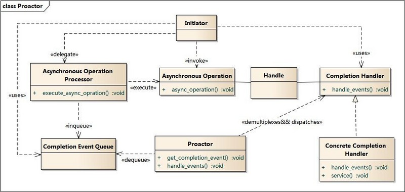
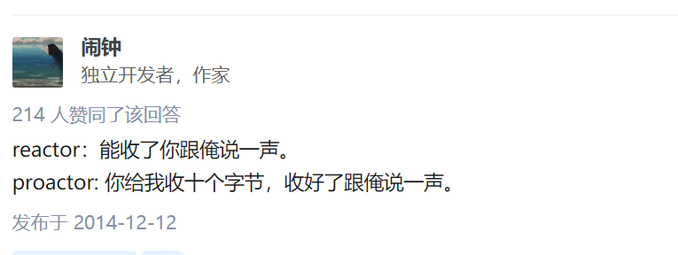

## Proactor模式

之前的笔记提到Reactor模式，那么Proactor模式也是必须得了解的。

  

Proactor主动器模式包含如下角色

- Handle 句柄；用来标识socket连接或是打开文件；
- Asynchronous Operation Processor：异步操作处理器；**负责执行异步操作，一般由操作系统内核实现**；
- Asynchronous Operation：**异步操作**
- Completion Event Queue：完成事件队列；异步操作完成的结果放到队列中等待后续使用
- Proactor：主动器；为应用程序进程提供事件循环；从完成事件队列中取出异步操作的结果，分发调用相应的后续处理逻辑；
- Completion Handler：完成事件接口；一般是由回调函数组成的接口；
- Concrete Completion Handler：完成事件处理逻辑；实现接口定义特定的应用处理逻辑；

总体流程和Reactor很像

1. 应用程序启动，调用异步操作处理器提供的异步操作接口函数，调用之后应用程序和异步操作处理就独立运行；应用程序可以调用新的异步操作，而其它操作可以并发进行；
2. 应用程序启动Proactor主动器，进行无限的事件循环，等待完成事件到来；
3. 异步操作处理器执行异步操作，完成后将结果放入到完成事件队列；
4. 主动器从完成事件队列中取出结果，分发到相应的完成事件回调函数处理逻辑中；

### 重点 Reactor和Proactor区别

Reactor模型： 
1 向事件分发器注册事件回调 
2 事件发生 
3 事件分发器调用之前注册的函数 
4 在回调函数中读取数据，对数据进行后续处理 
Reactor模型实例：libevent，Redis、ACE

Proactor模型： 
1 向事件分发器注册事件回调 
2 事件发生 
3 操作系统读取数据，并放入应用缓冲区，然后通知事件分发器 
4 事件分发器调用之前注册的函数 
5 在回调函数中对数据进行后续处理 
Preactor模型实例：ASIO

#### 主动和被动

以主动写为例：

- Reactor将handle放到select()，等待可写就绪，然后调用write()写入数据；写完处理后续逻辑；
- Proactor调用aoi_write后立刻返回，由内核负责写操作，写完后调用相应的回调函数处理后续逻辑；

可以看出，Reactor被动的等待指示事件的到来并做出反应；它有一个等待的过程，做什么都要先放入到监听事件集合中等待handler可用时再进行操作；
Proactor直接调用异步读写操作，调用完后立刻返回；

Reactor处理耗时长的操作会造成事件分发的阻塞，影响到后续事件的处理；

Proactor实现逻辑复杂；依赖操作系统对异步的支持，目前实现了纯异步操作的操作系统少，实现优秀的如windows IOCP，但由于其windows系统用于服务器的局限性，目前应用范围较小；而Unix/Linux系统对纯异步的支持有限，应用事件驱动的主流还是通过select/epoll来实现；

知乎有个形象的比喻：

