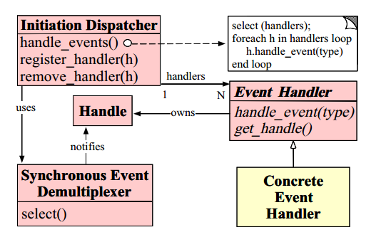

## Reactor模式
Reactor模式是事件驱动模型，是个非常经典的IO服务设计模式。

### BIO模式的介绍
在操作系统笔记中，我们了解了5种基本的IO模型。那么对应到IO服务设计中，阻塞IO的服务可如下设计：

这就是经典的每连接对应一个线程的同步阻塞I/O模式。

无非就是当有client来连接的时候，server新开一个线程去处理。

线程可以用线程池去维护。

优点：

 - 使用简单，容易编程
 - 在多核系统下，能够充分利用了多核CPU的资源。即，当I/O阻塞系统，但CPU空闲的时候，可以利用多线程使用CPU资源。

缺点：

 - 线程生命周期的开销非常高。
 - 在可创建线程的数量上存在一个限制。
 - 线程的切换成本是很高的
 - 容易造成锯齿状的系统负载。一旦线程数量高但外部网络环境不是很稳定，就很容易造成大量请求的结果同时返回，激活大量阻塞线程从而使系统负载压力过大。
 - 若是长连接的情况下并且客户端与服务器端交互并不频繁的，那么客户端和服务器端的连接会一直保留着，对应的线程也就一直存在在，但因为不频繁的通信，导致大量线程在大量时间内都处于空置状态。

## Reactor反应器模式
Reactor模式(反应器模式)是一种处理一个或多个客户端并发交付服务请求的事件设计模式。当请求抵达后，服务处理程序使用**I/O多路复用策略**，然后同步地派发这些请求至相关的请求处理程序。

这个IO多路复用模型，可以参考相关笔记。

上图是Reactor模式的基本模型，左侧存在多个并发的输入源，中间是一个服务处理单元，进行服务的分发，右侧是请求处理单元，负责实际的任务处理。这个Service Handler会同步的将输入的请求（Event）多路复用的(epoll)分发给相应的Request Handler。

从结构上，这有点类似生产者消费者模式，即有一个或多个生产者将事件放入一个Queue中，而一个或多个消费者主动的从这个Queue中Poll事件来处理；

**而Reactor模式则并没有Queue来做缓冲，每当一个Event输入到Service Handler之后，该Service Handler会主动的根据不同的Event类型将其分发给对应的Request Handler来处理**。

因此，在Reactor模式中，我们需要抽象出输入，请求分发单元，请求处理单元，三种大类并分别实现即可。

Reactor的优点如下：

1. 解耦合，分离各个模块职责，输入分发计算分开。
2. 高度模块化和可复用性，职责专注，提升类的可复用性。
3. 提升了并发性能，不需要一个IO创建一个线程，节省开销。

#### update补充

Reactor 模式指出，在等待 IO 时，线程可以先退出，这样就不会因为有线程在等待 IO 而占用资源。也就是说，其实reator就是用单线程模式，通过**事件循环**来分发任务。利用事件驱动的方式，要求线程在退出之前向 event loop 注册回调函数，这样 IO 完成时 event loop 就可以调用回调函数完成剩余的操作。

所以reactor模式，条件反射下就要想到event loop，事件驱动模式，也就会想到我们之前所说的select，poll，epoll，这三个都是事件驱动的模型。