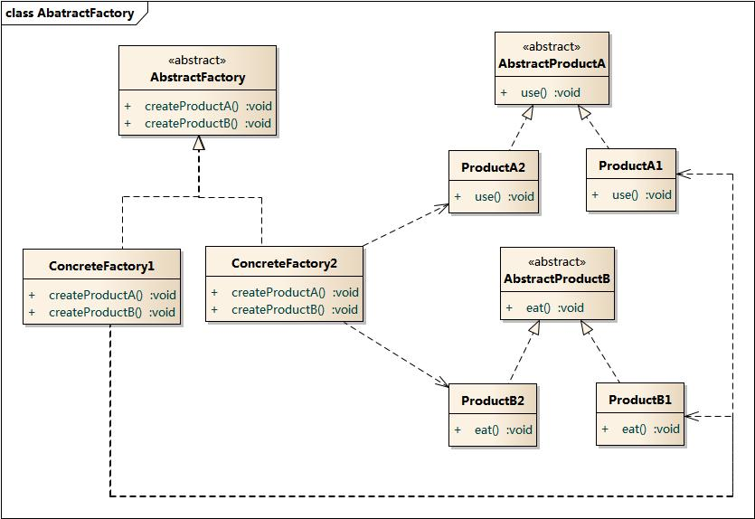

## 工厂模式

### 简单工厂模式
简单工厂模式包含如下角色：

 - Factory：工厂角色 工厂角色负责**实现创建所有实例的内部逻辑**
 - Product：抽象产品角色 抽象产品角色是所创建的所有对象的**父类**，负责描述所有实例所共有的公共接口
 - ConcreteProduct：具体产品角色 具体产品角色是创建目标，所有创建的对象都充当这个角色的**某个具体类的实例**。

如上图，有一个简单的工厂类Factory负责实现创建子类的逻辑。具体产生哪个product由传递给Factory的参数说了算。

#### 优点
 - **解耦**，客户端可以免除直接创建产品对象的责任，而仅仅“消费”产品；简单工厂模式通过这种做法实现了**对责任的分割**
 - 客户端无须知道所创建的具体产品类的类名，只需要知道具体产品类所对应的参数即可
 - 通过**引入配置文件**，可以在不修改任何客户端代码的情况下更换和增加新的具体产品类，在一定程度上提高了系统的灵活性。

#### 缺点
 - 由于工厂类集中了所有产品创建逻辑，**一旦不能正常工作，整个系统都要受到影响**。
 - 使用简单工厂模式将会增加系统中类的个数，在一定程序上**增加了系统的复杂度**和理解难度。
 - **系统扩展困难**，一旦添加新产品就不得不修改工厂逻辑，在产品类型较多时，有可能造成工厂逻辑过于复杂，不利于系统的扩展和维护。

### 工厂模式
工厂方法模式(Factory Method Pattern)又称为工厂模式，也叫虚拟构造器(Virtual Constructor)模式或者多态工厂(Polymorphic Factory)模式。

工厂父类负责定义创建产品对象的公共接口，而工厂子类则负责生成具体的产品对象，这样做的目的是**将产品类的实例化操作延迟到工厂子类中完成**，即通过工厂子类来确定究竟应该实例化哪一个具体产品类。

工厂方法模式包含如下角色：

 - Product：抽象产品
 - ConcreteProduct：具体产品
 - Factory：抽象工厂
 - ConcreteFactory：具体工厂

工厂方法模式是**简单工厂模式的进一步抽象和推广**。由于使用了面向对象的多态性，工厂方法模式保持了简单工厂模式的优点，而且克服了它的缺点。在工厂方法模式中，核心的工厂类不再负责所有产品的创建，而是将具体创建工作交给子类去做。这个核心类仅仅负责给出具体工厂必须实现的接口，而不负责哪一个产品类被实例化这种细节，这使得工厂方法模式可以允许系统在不修改工厂角色的情况下引进新产品。

#### 实例

某系统日志记录器要求支持多种日志记录方式，如文件记录、数据库记录等，且用户可以根据要求动态选择日志记录方式， 现使用工厂方法模式设计该系统。

#### 优点
 - 用户只需要关心所需产品对应的工厂，无须关心创建细节，甚至无须知道具体产品类的类名(**知道接口就可以了**)。
 - **多态性设计是工厂方法模式的关键**。它能够使工厂可以自主确定创建何种产品对象，而如何创建这个对象的细节则完全封装在具体工厂内部。工厂方法模式之所以又被称为多态工厂模式，是因为所有的具体工厂类都具有同一抽象父类。
 - 在系统中加入新产品时，无须修改抽象工厂和抽象产品提供的接口，无须修改客户端，也无须修改其他的具体工厂和具体产品，而只要添加一个具体工厂和具体产品就可以了。这样，**系统的可扩展性也就变得非常好，完全符合“开闭原则”(开闭原则就是对扩展开放，对修改关闭)**。

#### 缺点
 - 添加新产品时，需要编写新的具体产品类，而且还要提供与之对应的具体工厂类，系统中类的个数将成对增加，在**一定程度上增加了系统的复杂度**，有更多的类需要编译和运行，会给系统带来一些额外的开销。
 - 在客户端代码中均使用抽象层进行定义，增加了系统的抽象性和理解难度，且在实现时可能需要用到DOM、反射等技术，增加了系统的实现难度。

### 抽象工厂模式
在工厂方法模式中具体工厂负责生产具体的产品，每一个具体工厂对应一种具体产品，工厂方法也具有唯一性，一般情况下，一个具体工厂中只有一个工厂方法或者一组重载的工厂方法。但是有时候我们**需要一个工厂可以提供多个产品对象，而不是单一的产品对象**。

当系统所提供的工厂所需生产的具体产品并不是一个简单的对象，而是多个位于不同产品等级结构中属于不同类型的具体产品时需要使用抽象工厂模式。

抽象工厂模式包含如下角色：

 - AbstractFactory：抽象工厂
 - ConcreteFactory：具体工厂
 - AbstractProduct：抽象产品
 - Product：具体产品

**zwlj：和工厂模式一样，也是分为了四个块，但不同的是，这次的具体工厂生产的并不是某一个具体的产品了，而是某几种产品的组合！**

#### 优点
 - 抽象工厂模式隔离了具体类的生成，使得客户并不需要知道什么被创建。由于这种隔离，更换一个具体工厂就变得相对容易。所有的具体工厂都实现了抽象工厂中定义的那些公共接口，因此只需改变具体工厂的实例，就可以在某种程度上改变整个软件系统的行为。
 - 当一个产品族中的多个对象被设计成一起工作时，它能够保证客户端始终只使用同一个产品族中的对象。
 - 增加新的具体工厂和产品族很方便，无须修改已有系统，符合“开闭原则”。

#### 缺点
 - 在添加新的产品对象时，难以扩展抽象工厂来生产新种类的产品，这是因为在抽象工厂角色中规定了所有可能被创建的产品集合，要支持新种类的产品就意味着要对该接口进行扩展，而这将涉及到对抽象工厂角色及其所有子类的修改，显然会带来较大的不便。
 - 开闭原则的倾斜性（增加新的工厂和产品族容易，增加新的产品等级结构麻烦）。

zwlj：比如我有个套装产品接口，生产一件某品牌裤子和一件某品牌衣服。如若我想改变这个接口，使得套装是一个衣服裤子和一双鞋子。那修改起来就很麻烦。

#### 应用
在很多软件系统中需要**更换界面主题**，要求界面中的按钮、文本框、背景色等一起发生改变时，可以使用抽象工厂模式进行设计。
