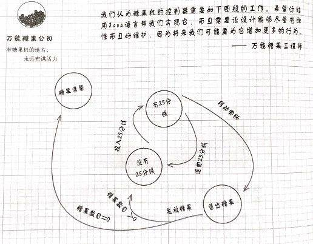

## 状态模式
在状态模式（State Pattern）中，类的行为是基于它的状态改变的。这种类型的设计模式属于行为型模式。

**意图：允许对象在内部状态发生改变时改变它的行为，对象看起来好像修改了它的类。**

### 模式结构

状态模式包含如下角色：

 - Context: 环境类
 - State: 抽象状态类
 - ConcreteState: 具体状态类


### Python情景示例

我们假定有个糖果贩卖机，会根据状态做出不同的动作，我们如下设计：




``` python
#! -*- coding: utf-8 -*-

class GumballMachine:

    # 找出所有状态，并创建实例变量来持有当前状态，然后定义状态的值
    STATE_SOLD_OUT = 0
    STATE_NO_QUARTER = 1
    STATE_HAS_QUARTER = 2
    STATE_SOLD = 3

    state = STATE_SOLD_OUT

    def __init__(self, count=0):
        self.count = count
        if count > 0:
            self.state = self.STATE_NO_QUARTER

    def __str__(self):
        return "Gumball machine current state: %s" % self.state

    def insert_quarter(self):
        # 投入25分钱
        if self.state == self.STATE_HAS_QUARTER: # 如果已经投过
            print("You can't insert another quarter")
        elif self.state == self.STATE_NO_QUARTER: # 如果没有投过
            self.state = self.STATE_HAS_QUARTER
            print("You inserted a quarter")
        elif self.state == self.STATE_SOLD_OUT: # 如果已经售罄
            print("You can't insert a quarter, the machine is sold out")
        elif self.state == self.STATE_SOLD: # 如果刚刚买了糖果
            print("Please wait, we're already giving you a gumball")

    def eject_quarter(self):
        # 退回25分
        if self.state == self.STATE_HAS_QUARTER:
            print("Quarter returned")
            self.state = self.STATE_NO_QUARTER
        elif self.state == self.STATE_NO_QUARTER:
            print("You haven't inserted a quarter")
        elif self.state == self.STATE_SOLD:
            print("Sorry, you alread turned the crank")
        elif self.state == self.SOLD_OUT:
            print("You can't eject, you haven't inserted")

    def turn_crank(self):
        # 转动曲柄
        if self.state == self.STATE_SOLD:
            print("Turning twice doesn't get you another gumball")
        elif self.state == self.STATE_NO_QUARTER:
            print("You turned but there's no quarter")
        elif self.state == self.STATE_SOLD_OUT:
            print("You turned, but there are no gumballs")
        elif self.state == self.STATE_HAS_QUARTER:
            print("You turned...")
            self.state = self.STATE_SOLD
            self.dispense()
    
    def dispense(self):
        # 发放糖果
        if self.state == self.STATE_SOLD:
            print("A gumball comes rolling out the slot")
            self.count -= 1
            if self.count == 0:
                self.state = self.STATE_SOLD_OUT
            else:
                self.state = self.STATE_NO_QUARTER
        elif self.state == self.STATE_NO_QUARTER:
            print("You need to pay first")
        elif self.state == self.STATE_SOLD_OUT:
            print("No gumball dispensed")
        elif self.state == self.STATE_HAS_QUARTER:
            print("No gumball dispensed")


if __name__ == "__main__":
    # 以下是代码测试
    gumball_machine = GumballMachine(5) # 装入5 个糖果
    print(gumball_machine)

    gumball_machine.insert_quarter() # 投入25分钱
    gumball_machine.turn_crank() # 转动曲柄
    print(gumball_machine)

    gumball_machine.insert_quarter() #投入25分钱
    gumball_machine.eject_quarter()  # 退钱
    gumball_machine.turn_crank()     # 转动曲柄

    print(gumball_machine)
    
    gumball_machine.insert_quarter() # 投入25分钱
    gumball_machine.turn_crank() # 转动曲柄 
    gumball_machine.insert_quarter() # 投入25分钱 
    gumball_machine.turn_crank()  # 转动曲柄
    gumball_machine.eject_quarter() # 退钱

    print(gumball_machine)
```

上面代码过于面向过程，实质上要更符合面向对象，我们应该把每一个状态都扩展成为一个类，这样加入新状态的时候我们也能很好的处理。

``` python
# 添加WinnerState 类，只有dispense 方法不同，可以从SoldState 类继承
class WinnerState(SoldState):
    
    def __str__(self):
        return "winner"

    def dispense(self):
        print("You're a WINNER! You get two gumballs for your quarter")
        self.gumball_machine.release_ball()
        if gumball_machine.count == 0:
            self.gumball_machine.state = self.gumball_machine.soldout_state
        else:
            self.gumball_machine.release_ball()
            if gumball_machine.count > 0:
                self.gumball_machine.state = self.gumball_machine.no_quarter_state
            else:
                print("Oops, out of gumballs!")
                self.gumball_machine.state = self.gumball_machine.soldout_state

# 修改turn_crank 方法
class HasQuarterState(State):
    ...
    def turn_crank(self):
        print("You turned...")
        winner = random.randint(0, 9)
        if winner == 4 and self.gumball_machine.count > 1: # 如果库存大于 1 并且随机数等于4（可以是0到9任意值）
            self.gumball_machine.state = self.gumball_machine.winner_state
        else:
            self.gumball_machine.state = self.gumball_machine.sold_state


# 在 GumballMachine 中初始化
class GumballMachine:

    def __init__(self, count=0):
        self.count = count
        # 找出所有状态，并创建实例变量来持有当前状态，然后定义状态的值
        ...
        self.winner_state = WinnerState(self)
        ...
```