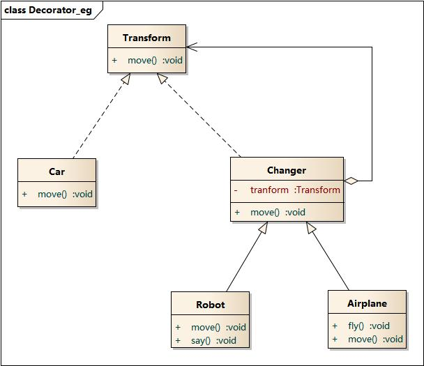

## 装饰模式
装饰模式(Decorator Pattern) ：**动态地给一个对象增加一些额外的职责(Responsibility)**，就增加对象功能来说，装饰模式比生成子类实现更为灵活。其别名也可以称为包装器(Wrapper)，与适配器模式的别名相同，但它们适用于不同的场合。根据翻译的不同，装饰模式也有人称之为“油漆工模式”，它是一种对象结构型模式。

装饰模式包含如下角色：

 - Component: 抽象构件
 - ConcreteComponent: 具体构件
 - Decorator: 抽象装饰类
 - ConcreteDecorator: 具体装饰类

### 优点
 - 但是装饰模式可以提供比继承更多的灵活性。

 - 可以通过一种动态的方式来扩展一个对象的功能，通过配置文件可以在运行时选择不同的装饰器，从而实现不同的行为。

 - 通过使用不同的具体装饰类以及这些装饰类的排列组合，可以创造出很多不同行为的组合。可以使用多个具体装饰类来装饰同一对象，得到功能更为强大的对象。

 - 具体构件类与具体装饰类可以独立变化，用户可以根据需要增加新的具体构件类和具体装饰类，在使用时再对其进行组合，原有代码无须改变，符合“开闭原则”

### 实例：变形金刚
变形金刚在变形之前是一辆汽车，它可以在陆地上移动。当它变成机器人之后除了能够在陆地上移动之外，还可以说话；如果需要，它还可以变成飞机，除了在陆地上移动还可以在天空中飞翔。

