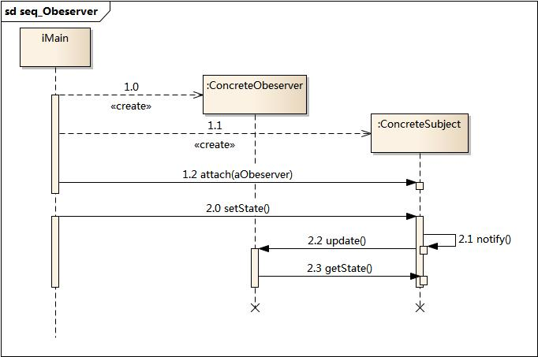

## 观察者模式
建立一种**对象与对象之间的依赖关系**，一个对象发生改变时将**自动通知其他对象**，其他对象将相应做出反应。在此，**发生改变的对象称为观察目标，而被通知的对象称为观察者**，一个观察目标可以对应多个观察者，而且这些观察者之间没有相互联系，可以根据需要增加和删除观察者，使得系统更易于扩展，这就是观察者模式的模式动机。

观察者模式(Observer Pattern)：定义对象间的一种**一对多依赖关系**，使得每当一个对象状态发生改变时，其相关依赖对象皆得到通知并被自动更新。观察者模式又叫做发布-订阅（Publish/Subscribe）模式、模型-视图（Model/View）模式、源-监听器（Source/Listener）模式或从属者（Dependents）模式。

观察者模式包含如下角色：

 - Subject: 目标
 - ConcreteSubject: 具体目标
 - Observer: 观察者(被通知的对象)
 - ConcreteObserver: 具体观察者

以下是序列图

zwlj：从时序图可以看出，观察者模式中，首先会将一系列obeserver观察者绑定到一系列的Subject里，然后一旦Subject的状态state发生改变，Subject就会通知Obeserver观察者进行一系列操作。

### 优点
 - 观察者模式可以**实现表示层和数据逻辑层的分离**，并定义了稳定的消息更新传递机制，抽象了更新接口，使得可以有各种各样不同的表示层作为具体观察者角色。
 - 观察者模式在观察目标和观察者之间建立一个**抽象的耦合**。
 - 观察者模式支持广播通信。
 - 观察者模式符合“开闭原则”的要求。

### 缺点

 - 如果一个观察目标对象有很多直接和间接的观察者的话，将**所有的观察者都通知到会花费很多时间**。
 - 如果在观察者和观察目标之间有循环依赖的话，观察目标会触发它们之间进行循环调用，可能导致系统崩溃(不能有循环调用)。
 - 观察者模式没有相应的机制让观察者知道所观察的目标对象是怎么发生变化的，而仅仅只是知道观察目标发生了变化。

### 举例
MVC模式是一种架构模式，它包含三个角色：模型(Model)，视图(View)和控制器(Controller)。**观察者模式可以用来实现MVC模式**

观察者模式中的观察目标就是MVC模式中的模型(Model)，而观察者就是MVC中的视图(View)，控制器(Controller)充当两者之间的中介者(Mediator)。当模型层的数据发生改变时，视图层将自动改变其显示内容。
