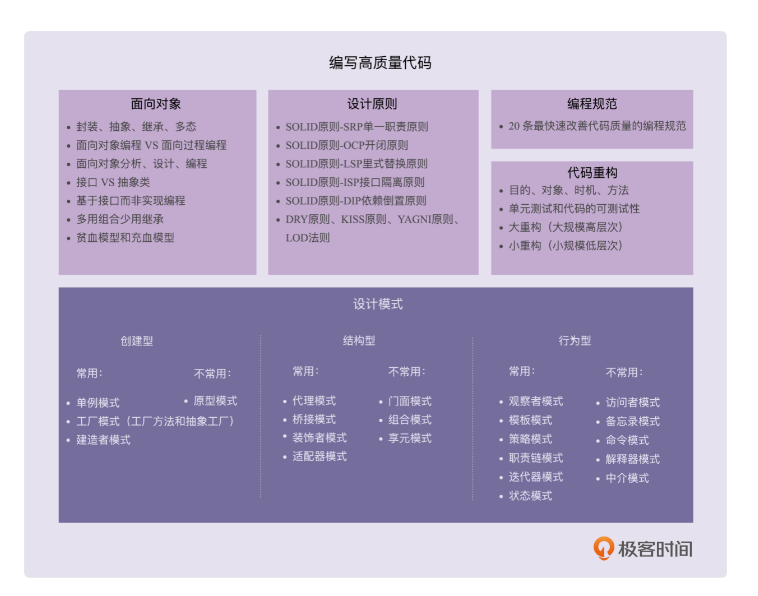

## 概况

要具备编写高质量代码的能力，需要学习一些编程方法论，其中就包含面向对象（我们可以把它看成一种设计思想）、设计原则、设计模式、编程规范、重构技巧等。

### 面向过程与面向对象

对于简单程序的开发来说，不管是用面向过程编程风格，还是用面向对象编程风格，差别确实不会很大，甚至有的时候，面向过程的编程风格反倒更有优势。因为需求足够简单，整个程序的处理流程只有一条主线，很容易被划分成顺序执行的几个步骤，然后逐句翻译成代码

但对于大规模复杂程序的开发来说，整个程序的处理流程错综复杂，并非只有一条主线。如果把整个程序的处理流程画出来的话，会是一个网状结构。如果我们再用面向过程编程这种流程化、线性的思维方式，去翻译这个网状结构，去思考如何把程序拆解为一组顺序执行的方法，就会比较吃力。这个时候，面向对象的编程风格的优势就比较明显了。

面向对象编程是以类为思考对象。在进行面向对象编程的时候，我们并不是一上来就去思考，如何将复杂的流程拆解为一个一个方法，而是采用曲线救国的策略，先去思考如何给业务建模，如何将需求翻译为类，如何给类之间建立交互关系，而完成这些工作完全不需要考虑错综复杂的处理流程。当我们有了类的设计之后，然后再像搭积木一样，按照处理流程，将类组装起来形成整个程序。这种开发模式、思考问题的方式，能让我们在应对复杂程序开
发的时候，思路更加清晰。

除此之外，面向对象编程还提供了一种更加清晰的、更加模块化的代码组织方式。比如，我们开发一个电商交易系统，业务逻辑复杂，代码量很大，可能要定义数百个函数、数百个数据结构，那如何分门别类地组织这些函数和数据结构，才能不至于看起来比较凌乱呢？类就是一种非常好的组织这些函数和数据结构的方式，是一种将代码模块化的有效手段。