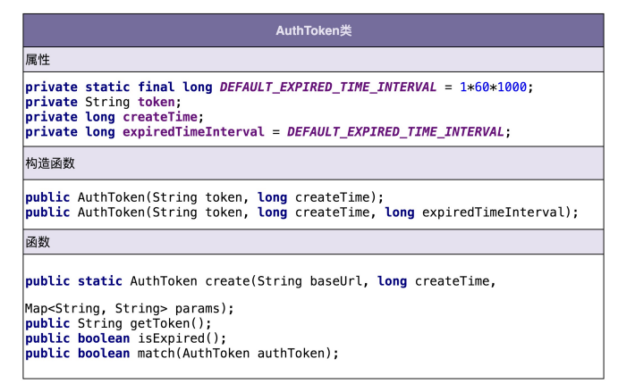
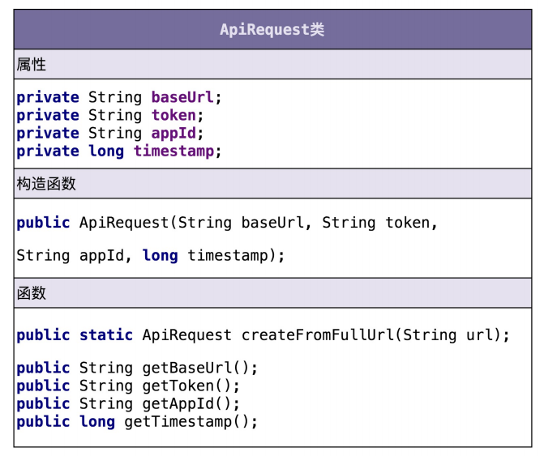
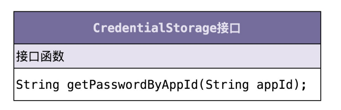
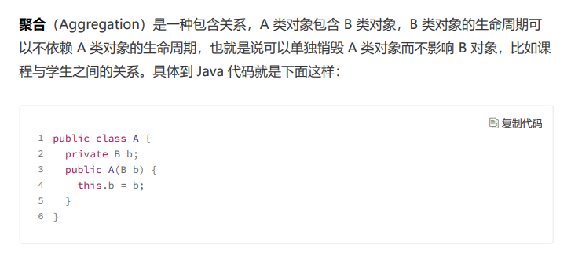
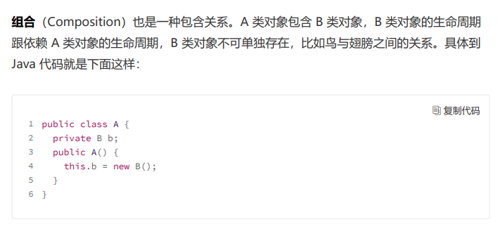
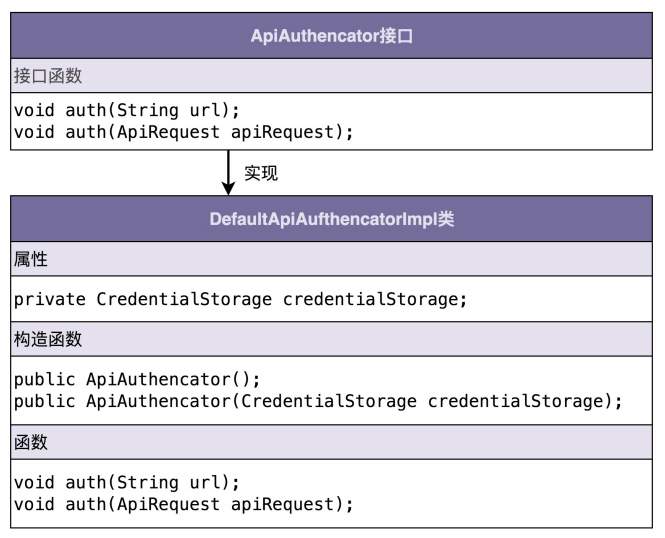

## 面向对象需求分析

我们知道，面向对象分析的产出是详细的需求描述，那面向对象设计的产出就是类。在面向对象设计环节，我们将需求描述转化为具体的类的设计。

我们把这一设计环节拆解细化一下，主要包含以下几个部分：

- 划分职责进而识别出有哪些类；
- 定义类及其属性和方法；
- 定义类与类之间的交互关系；
- 将类组装起来并提供执行入口。

### 划分职责进而识别出有哪些类

好比说开发一个接口鉴权功能，需求如下：

- 调用方进行接口请求的时候，将 URL、AppID、密码、时间戳拼接在一起，通过加密算法生成 token，并且将 token、AppID、时间戳拼接在 URL 中，一并发送到微服务端。
- 微服务端在接收到调用方的接口请求之后，从请求中拆解出 token、AppID、时间戳。微服务端首先检查传递过来的时间戳跟当前时间，是否在 token 失效时间窗口内。如果已经超过失效时间，那就算接口调用鉴权失败，拒绝接口调用请求。
- 如果 token 验证没有过期失效，微服务端再从自己的存储中，取出 AppID 对应的密码，通过同样的 token 生成算法，生成另外一个 token，与调用方传递过来的 token 进行匹配。如果一致，则鉴权成功，允许接口调用；否则就拒绝接口调用。

首先，我们要做的是逐句阅读上面的需求描述，拆解成小的功能点，一条一条罗列下来。注意，拆解出来的每个功能点要尽可能的小。每个功能点只负责做一件很小的事情（专业叫法是“单一职责”）

功能点列表：

1. 把 URL、AppID、密码、时间戳拼接为一个字符串；
2. 对字符串通过加密算法加密生成 token；
3. 将 token、AppID、时间戳拼接到 URL 中，形成新的 URL；
4. 解析 URL，得到 token、AppID、时间戳等信息；
5. 从存储中取出 AppID 和对应的密码；
6. 根据时间戳判断 token 是否过期失效；
7. 验证两个 token 是否匹配；

从上面的功能列表中，我们发现，1、2、6、7 都是跟 token 有关，负责 token 的生成、验证；3、4 都是在处理 URL，负责 URL 的拼接、解析；5 是操作 AppID 和密码，负责从存储中读取 AppID 和密码。所以，我们可以粗略地得到三个核心的类：AuthToken、Url、CredentialStorage。AuthToken 负责实现 1、2、6、7 这四个操作；Url 负责 3、4两个操作；CredentialStorage 负责 5 这个操作。

但如果我们面对的是更加大型的软件开发、更加复杂的需求开发，涉及的功能点可能会很多，对应的类也会比较多，像刚刚那样根据需求逐句罗列功能点的方法，最后会得到一个长长的列表，就会有点凌乱、没有规律。针对这种复杂的需求开发，我们首先要做的是进行模块划分，将需求先简单划分成几个小的、独立的功能模块，然后再在模块内部，应用我们刚刚讲的方法，进行面向对象设计。而模块的划分和识别，跟类的划分和识别，是类似的套路。

### 定义类及其属性和方法

 

刚刚我们通过分析需求描述，识别出了三个核心的类，它们分别是 AuthToken、Url 和CredentialStorage。现在我们来看下，每个类都有哪些属性和方法。我们还是从功能点列表中挖掘。

对于方法的识别，很多面向对象相关的书籍，一般都是这么讲的，识别出需求描述中的动词，作为候选的方法，再进一步过滤筛选。类比一下方法的识别，我们可以把功能点中涉及的名词，作为候选属性，然后同样进行过滤筛选。

从上面的类图中，我们可以发现这样三个小细节。

- 第一个细节：并不是所有出现的名词都被定义为类的属性，比如 URL、AppID、密码、
  时间戳这几个名词，我们把它作为了方法的参数。
- 第二个细节：我们还需要挖掘一些没有出现在功能点描述中属性，比如 createTime，
  expireTimeInterval，它们用在 isExpired() 函数中，用来判定 token 是否过期。
- 第三个细节：我们还给 AuthToken 类添加了一个功能点描述中没有提到的方法
  getToken()。

虽然需求描述中，我们都是以 URL 来代指接口请求，但是，接口请求并不一定是以 URL
的形式来表达，还有可能是 dubbo RPC 等其他形式。为了让这个类更加通用，命名更加贴
切，我们接下来把它命名为 ApiRequest。下面是我根据功能点描述设计的 ApiRequest
类。

CredentialStorage 类非常简单，类图如下所示。为了做到抽象封装具体的存储方式，我们将 CredentialStorage 设计成了接口，基于接口而非具体的实现编程。

### 类与类的交互

回顾一下几种类的交互关系：

其实无非就这么几种，继承(实现),聚合，组合

聚合跟组合是不一样的，聚合各自生命周期是独立的，而组合两者的生命周期不独立。

### 类组装并提供执行接口

接口鉴权并不是一个独立运行的系统，而是一个集成在系统上运行的组件，所以，我们封装
所有的实现细节，设计了一个最顶层的 ApiAuthencator 接口类，暴露一组给外部调用者
使用的 API 接口，作为触发执行鉴权逻辑的入口。

