## 面向对象uml设计
之前讲解过利用七步法分析基本用例图和类结构。得到基本用例图和类结构之后还能做进一步的**设计**。

得到用例图以后，完善用例图实现文档，实现各种细节，然后可以完成通信图，序列图，完整类图。

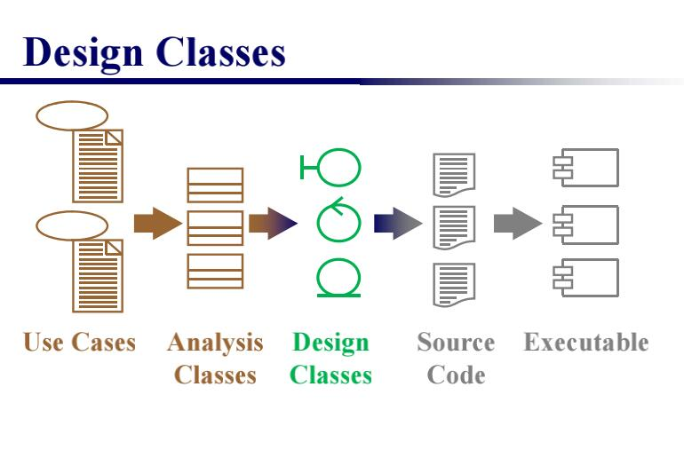

**zwlj：当我们利用uml进行面向对象设计的时候，我们7步法(见笔记)分析业务类，构建用类图和基本类图，然后再利用一定的步骤进行业务类设计，先分析后设计，这是两个过程**

在已经用7步法做好分析的情况下，以下是面向对象设计的过程

### 1.实现用例文档
这个步骤很重要，因为它提供了用户和系统交互的细节。这些细节有助于程序的构建和用户操作手册的编写。

#### step1 转换分析用例图为设计用例图

也就以“分析的”用例图文档为基础，构建交互情景的细节，将它变为“设计的”用例图文档。总的来说就是构建一个交互视图，什么时候弹窗，什么时候操作都做出具体的规定。

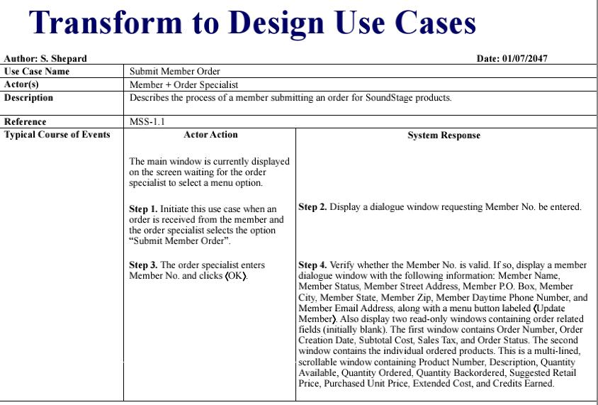

如上图两个，便是“analysis”用例图文档向“design”用例图文档的转变。实现文档中描述了具体的各种窗体细节，有助于程序的具体实现。

还要注意可选过程也要进行细节实现

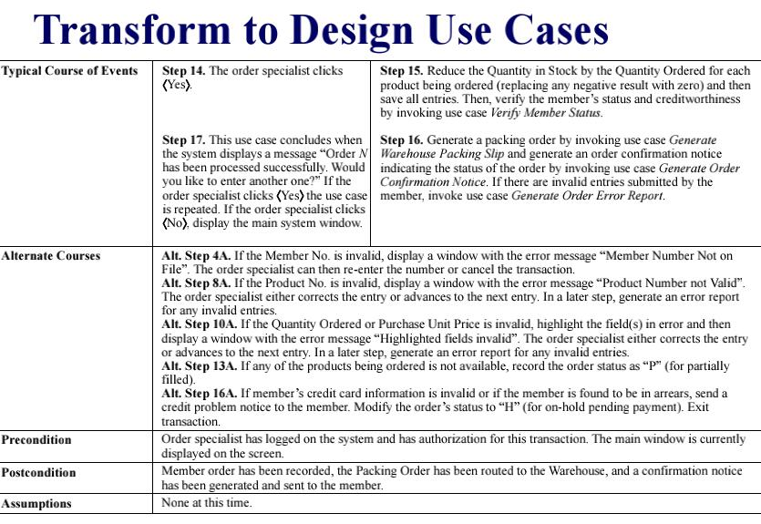

以上就是面向分析的用例图文档转变为面向设计的用例图文档。

具体的实现细节，因情景而异。

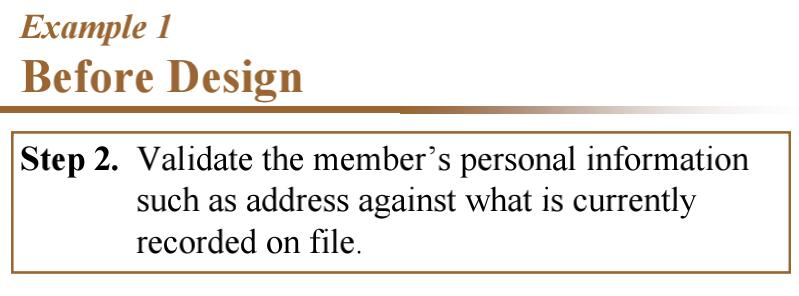

#### step2 更新用例图模型和相关文档
我们在step1中已经大致将面向分析的文档转换成了面向设计的文档，其中可能会增生一些新的usecase(由原usecase include或者extend出来的一些衍生子过程)。接下来我们只需要更新其他模型保持一致即可。

也就是说，文档更改后，我们的实际用例图和其他文档的过程也许会发生一些变化，这个时候就要去追踪这些变化并且修改来维持一致。

更新用例图，使用例图更加具体，根据document中新增的include或者extend衍生子过程更新use case图。

### 2.构建对象的交互和行为
也就是对于对象的类结构进行识别和分类

#### step1 识别和分出三种类结构
在uml面向对象设计笔记里有提到，设计类中，将类分为实体类，控制类和边界类。那么我们在这一个step里需要做的，就是根据1的use case实现文档，来辨别出这些类。

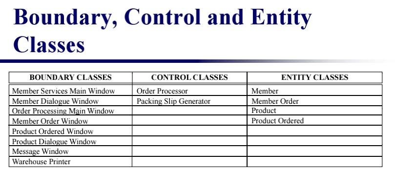

根据use case realization document，可以比较轻易地创建出三种类，边界类用于交互，控制类封装逻辑，实体类是持久化对象。**我们在之前的7步法分析中的类图，基本上都是实体类**。

#### step2 识别属性
分出三种类后，对于每一个具体类，都可以分析出其中具有什么属性，更新这些属性，并更新类图。

#### step3 构建高层对象交互模型
对于每一个use case，**创建一个通信图**，用这个通信图从high-level的角度，对行为进行建模。

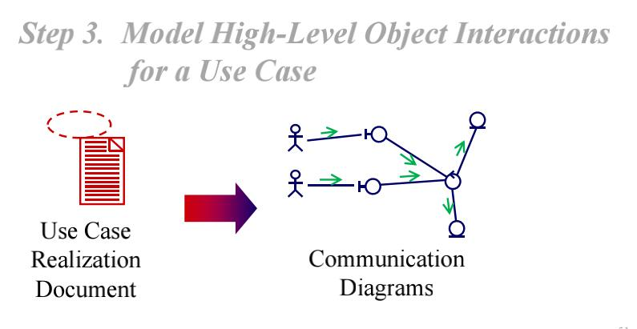

所以实质上也就是完成uml通信图

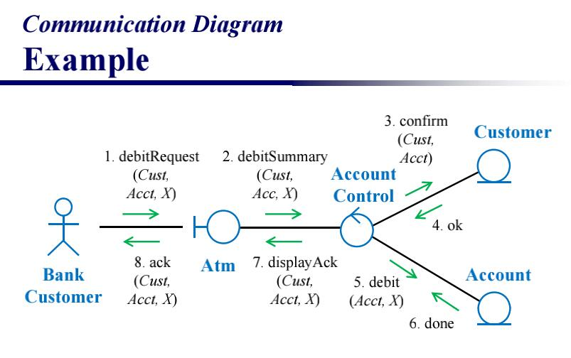

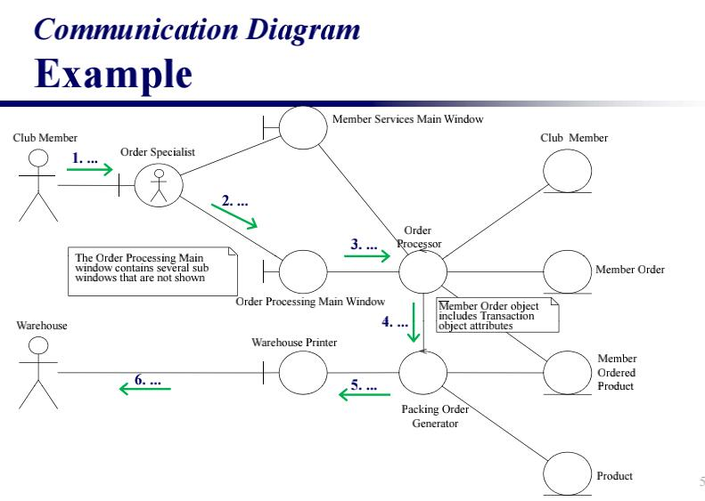

#### step4 识别出行为和责任
我们需要在Use case实现文档中，将动词抽取出来以识别**行为behavior**。

将动词抽取出来之后，我们需要识别出，这个行为是automatic的，亦或是manual的。如果这个行为是自动发生的，那么当然就需要和某一个具体的class有联系。

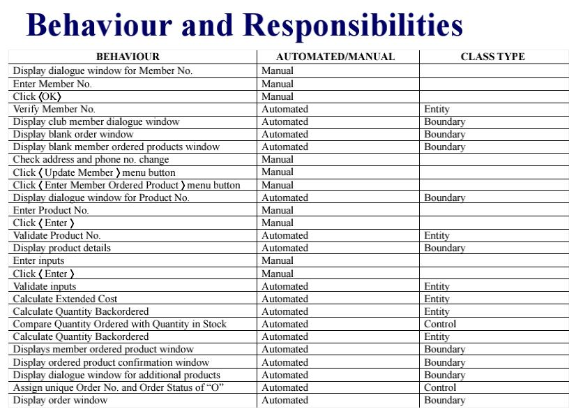

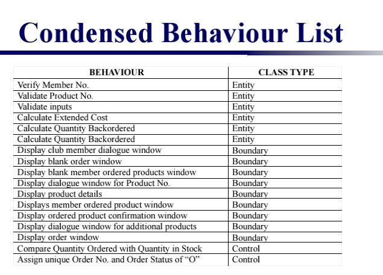

如上图，先识别出手动还是自动，最后标注这些行为是源于三大类中哪一个类。

最后归纳类与类之间的交互，交互有CURD原则

#### step5 构建更详细的对象交互模型

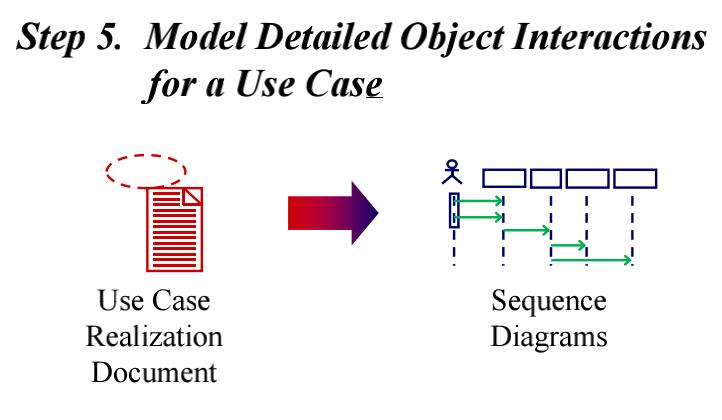

对每一个use case构建顺序图，然后将其转化为状态机图。

也就是构建顺序图和状态机图。

### 3.更新类图
重制类图，将**行为**整合进去，使其能够满足环境和需求。
