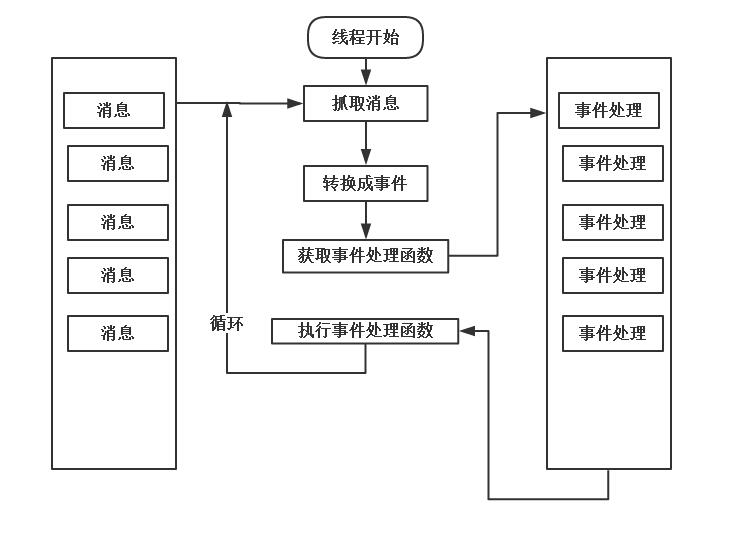
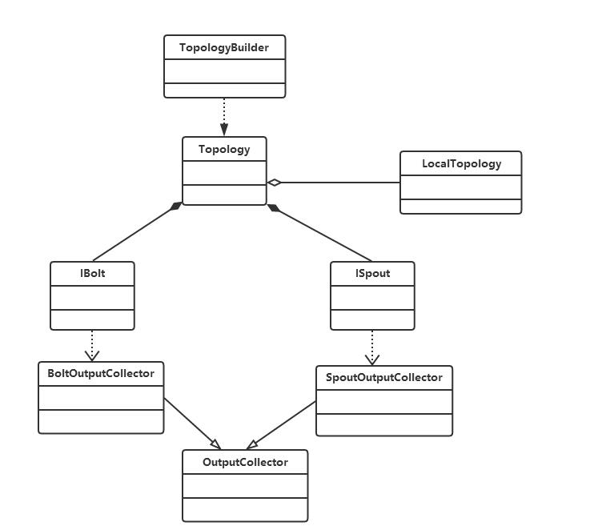

## 服务组件设计与实现

### Executor执行器
执行器是Manager中最重要的组成部分，每一个Manager都包含了多个Executor，这些Executor可以执行President分配的任务,且可以接受从其他执行器处传来的数据，在特定的时候启动并执行数据。

#### 事件驱动的消息队列
为了线程之间相互协作，采用基于消息队列的事件驱动机制。

本质上就是一个无穷循环，其他线程会发送消息到线程专用的消息队列中，工作线程则不断循环从消息队列中获取消息，并转换为对应事件。每个事件都用编号或者名字管理，通过编号可以找到事件处理函数(有用户提前注册事件)，接着执行事件即可。

#### Message消息接口
Message头文件在include/../message/Message.h下，其中定义了一个结构体，结构体内 **定义了一个枚举类型**，这个枚举类型是非限定域的。

示例中则是定义了一个Stop字段(消息)，为该消息赋予数字0.

Message接口中有一唯一成员变量_type,代表消息的类型，所有具体的消息类型都应该继承该Message接口。

#### 消息队列接口
接口头文件位于include/../message/MessageLoop.h下。MessageLoop的核心是一个Map,map<MessageType,Handler>,其中键值MessageType本质上就是一个int，由Message的消息接口我们可以知道就是一个整形数而已。

而Handler是一个function容器，封装了一个处理Message消息的函数，也就是包装了一个函数指针(类型是void(Message*))，构成伪函数。(概念可见伪函数，函数笔记)。通过这个Map，我们就可以通过消息索来找到处理事件函数。

消息队列不允许复制，所以我们将赋值操作符和拷贝构造函数设置成delete。

消息队列还有几个函数方法：

 - Run，启动消息队列
 - Stop，停止消息队列
 - PostMessage 向消息队列投递消息。

#### 消息队列管理器MessageLoopManager
跟消息队列同在MessageLoop.h中，用来统一管理消息循环(有不止1个消息队列，都由这个MessageLoopManager来统一管理)。

该类的核心依旧是一个map,类型是map<string,shared_ptr<MessageLoop>>,也就是根据名字即可得到一个消息队列的智能指针。

该类的作用就是解耦合。

Manager内部有一个Register函数，用来绑定对应的名字和消息队列智能指针。

PostMessgae用来发消息，从消息队列map中根据名字去除对应的消息队列，然后发送消息。

除此之外，为了保证队列管理器单例化，我们存在GetInstance方法，使用函数的局部静态变量解决初始化依赖是常用技巧。

#### Executor接口
终于讲到这个Executor执行器的接口了。Executor在base目录下，是一个模板类，便于我们以后写出不同的Executor。

Executor中，status表示Executor的状态，有Running和Stopping两种(有限制形枚举类)。

startTask方法负责启动任务，startTask接收两个参数，一个是任务名string，一个是具体的任务指针(spout或者bolt)。startTask设置任务名，保存任务ITask为智能指针成员对象，然后开启一个新的线程去执行任务.这个线程也是Executor的成员变量之一。

此外，Executor对象还持有一个消息队列，通过调用Executor类中的startThread来启动这个消息队列。而这个startThread方法会在startTask被调用时创建一个新的线程来执行。

正如上述所说。startThread会先调用OnCreate，并且在线程执行完以后调用OnStop，最后改回状态等待Manager的下一次调度。

#### 具体执行器SpoutExecutor和IboltExecutor
更具体的Spout消息源和Ibolt的执行器，继承自Executor接口，只需要继承的时候指定模板即可。

SpoutExecutor继承自Executor<ISpout>，而IboltExecutor继承自Executor<Ibolt>.

##### SpoutExecutor
SpoutExecutor的构造函数除了调用父类Executor的初始化以外，还初始化了私有变量_neeToStop.

设定了SetExecutorIndex函数来设置所属Manager中执行器的编号。

还有SetCommander来设置Commander，向外部发送命令，不受manager干涉。

有函数RandomDesitination，是随机数据发送策略的实现，如果用户数据发送策略定义为Random，那么OutputCollector每次发送数据前都会调用这个成员函数来询问发送到的网络位置。

同理GroupDestination，就是当策略被选为Group时，数据发送的位置

几个成员变量意义如下：

 - _needToStop,系统是否需要中断。
 - _commander 命令执行器，用于和其他节点消息通信。
 - _topology 正在执行的拓扑结构

### SandStorm任务UML架构

