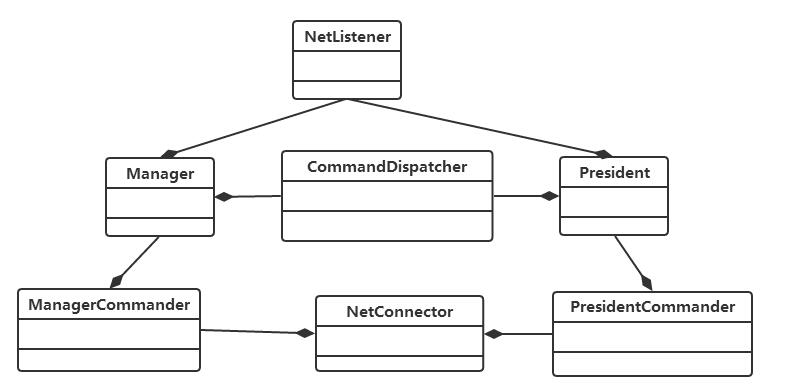

## 管理服务接口设计

### President功能
President类似于Storm中的Nimbus，负责管理整个集群。主要功能有：

 - 负责集群的启动和调度
 - 负责监视Manager的执行情况
 - 负责向Manager分配任务
 - 负责根据集群的执行情况，决定消息分发策略的执行方式。

President和Manager之间的架构图：

**Manager会主动推送消息给President，然后President负责对Manager进行调度。** 上图设计跟其他分布式系统一样，也叫分册管理架构设计。

我们会希望将President和Manager **设计成“快速失败fail fast”和“无状态stateless”**，

##### 管理宕机
正如前面所说，我们想将President和Manager设计成快速失败和无状态。我们可以使用 **守护进程** 来实现这些特性，当节点宕机的时候，守护进程可以很快将这些宕机节点重新启动。

注意，Hadoop并不是如此处理，Hadoop在管理节点(President或者Manager)宕机的时候，会让工作节点Executor全部停止。而SandStorm的设计则是让Executor节点 **暂时继续工作**，不过虽说如此，在宕机间隔下，管理节点(President,Manager)也无法在这个时候分配任务给Executor了。

### President设计
President有几个功能特性需要我们去实现：

1. 简单的网络通信，使用Socket保证节点之间的通信。
2. Topology的装载，要知道如何装载用户编写的Topology。
3. Manager的管理调度。

#### President与Manager的UML架构

Manager和President都有一个NetListener负责网络请求，都具有CommandDispatcher负责分发任务。

#### 网络通信功能(NetListener+NetConnector)
President中需要通过NetListener去做网络基本通信。NetListener接口在base目录下。这是一个消息监听类，进行网络监听。

接口中定义了一个DataReceiver类型，是一个可调用对象，接收TCP字符流。

接口中还定义了GetHost和SetHost方法，用来设置和获取连接的主机对象。StartListener负责启动网络监听器，开始监听网络。

DataThreadMain函数，是网络监听器的线程入口，一旦StartListener启动后，就会创建一个线程并且进入该函数，监听网络消息。

OnData是一个回调函数，当监听器监听到消息时，会调用用户注册的回调函数。

##### 假想实现NetListener
位于书p179，这里实现了两个函数，一个是StartListen，一个是DataThreadMain。这两个功能的具体实现都很直接。

StartListen就是开始监听本Manager节点的ip地址和端口，因为执行器会主动推送消息来。一旦发现有执行器推送消息过来，Accept，并且开启一个新的线程来执行DataThreadMain方法，这个方法要记得bind自身。

DataThreadMain方法其实主要负责读取数据，根据client的链接connection，读取数据，并把这一段数据交给NetListener的DataReceiver处理，DataReceiver是个函数，负责具体处理client的数据，DataThreadMain则负责接收数据。

这里要注意DataThreadMain设置了一个Lost变量，一旦读不到数据，则sleep一段时间且Lost变量加一，超过10次则认为有异常，抛出异常。

##### NetConnector
client连接到server上与其通信。也就是说负责与管理者(server)的NetListener互相通信。

里面的函数SendAndRecieve是同步的，也就是说只有服务器发送回复消息才回结束，否则会一直阻塞。

### Topology
用户可以编写Topology的逻辑，而我们的分布式系统负责装载调用。那么如何从本地装载一个动态库呢？

#### ITopology

首先ITopology的接口设计，里面内含几个纯虚函数。这几个函数基本上就是对私有成员变量Spout，Bolt
还有network的设置,network就是一个字符串容器vector。

#### Topology的装载
我们需要一个TopologyLoader来帮助系统把用户的Topology给装载进来。在base目录下，采用了C++动态加载(见c++笔记)的方法加载用户编写的具体Topology类。

### Manager实现
p186书。

Manager可以看做其实就是一个节点，这个节点管理这很多个任务(task),而这些任务又分别由许多个Executor执行。所以相当于一个节点有很多个线程，每个线程相当于一个Executor执行着任务。

Manager管理调度，存在着几个Map，managers Map用来映射manager名字和对应实例(Node)。SpoutTasks和boltTask用来映射名字和对应任务。

还有一个fieldDestination映射表，这个表的key是一个pair对象，这个pair代表的是任务源的任务名称和字段名称，**也就是pair\<任务源名字(string)，任务源字段(string)\>** .映射表的value值也是一个pair，对应Supervisor节点和执行器的编号，类型为pair\<Node,int\>

Manager有一个CommandDispatcher对象负责把网络消息转换成命令交给各个处理函数。

Manager调用Dipatcher的OnCommand方法来绑定函数，调用这个方法之后可以将对应的消息类型和处理的函数绑定起来。
