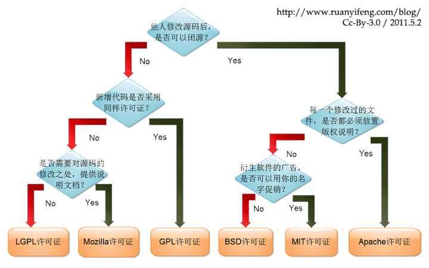

## 开源许可
授权协议就是授予你使用或修改软件等权利，由于软件受到著作权保护，未经授权使用即是侵犯著作权，属于违法行为，所以同意或签署软件授权协议是你使用或修改软件的前提条件。

既然是授权协议，我们可以知道，这个东西分为两部分：授权和协议。可以简单的理解为权利和义务。

协议即是指义务，指出你有哪些义务，例如不允许反向工程，不允许开外挂，不允许修改，不允许作为自己软件项目的一部分发布，必须在使用此软件的项目中标注使用了这项技术。如果你不遵守自己的义务（违背协议），那么你的授权就是无效的，即涉嫌侵犯著作权了。

比起不开源软件，大多数开源授权协议都比较简单，开源的特点就是开放源代码，这里的开放，并不是指随软件一并附上源代码的意思，而是源代码也给你了，你看着办吧。

开源软件的授权协议必须包含的权利是软件源代码的修改、演绎权，否则不是开源软件。所以各大协议主要是在义务上各有区别，譬如说GPL协议要求，基于该软件开发的任何软件，都必须以GPL协议发布，这也就是 **开源感染**。**也就是说你要用这个开源软件，就必须把你自己的软件变成开源的**。

开源协议的大致区别如下图

