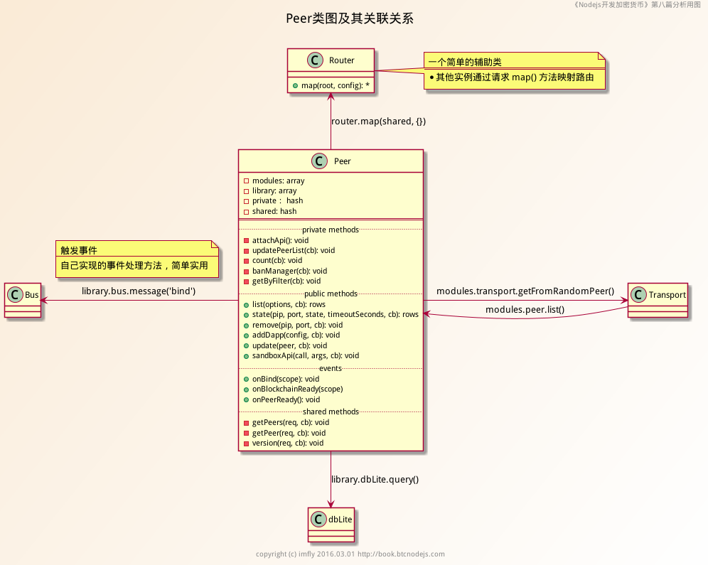
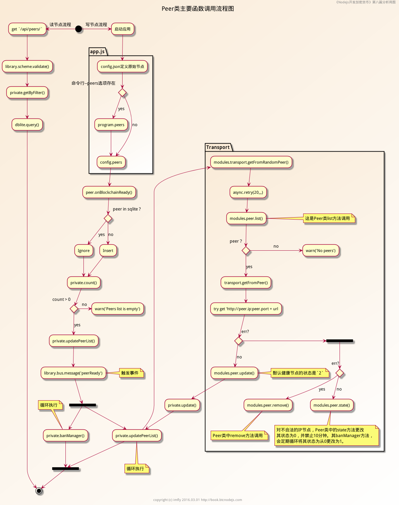
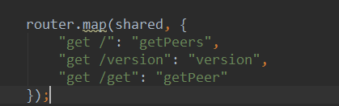

## p2p网络实现
ebookcoin使用nodejs实现了一个精巧的p2p网络，源码主要在这几个文件：

 - peer.js,在modules文件夹下
 - transport.js，在modules文件夹下
 - router.js 在helpers文件夹下

我们来看看官方给我们的uml类图：



看不清的化，可以打开原图看。

注意router是个辅助类，通过其中的map方法来映射路由。

当然官方也给出了流程图，加深我们的理解：



流程图看一时懵逼也不要紧了，下面进行核心分析。

### 路由扩展
在async的auto的network模块中，我们看到引入了express框架。express可以加载一系列的微应用中间件。

我们先看看helper文件夹下的router.js工具类。

观察代码我们发现文件导出一个router类，router类首先添加res扩展，给每个回包添加一个允许跨域的头部，这样可以允许全部客户端调用。

最后设置了router.map，这个map赋予了一个函数，这个函数式路由映射方法。

我们来观察一下自定义的map函数，接受两个参数root和config。这个config其实是一个路由配置对象，这个对象的键值形式诸如 “GET /xxx”,map函数做的就是遍历这个对象的每一个键值对，然后抽取出来，绑定到express对应的路由上。

如此一来很容易就能知道root其实也是一个处理函数的收纳对象，之前说的config键值是路径，value则是对应函数的处理路径。得到函数处理路径path之后，就会用调用root[path],对应的方法来处理。

就跟官方文档说的一样，这个map函数调用之后的作用就是绑定一系列的处理方法到express上：

```
router.get('/peers', function(req, res, next){
    root.getPeers(...);
})
```

这里还要提示一下，最后res回包的时候用了一个extend方法(继承自jquery)，其实就是合并一下response而已，从结果上看，就是给response对象多加一个success：true的属性罢了。

### 节点路由
接下来我们看看peer.js,位于module目录下。

总览一下peer.js文件，发现非常面向对象啊，都是以面向对象的组织架构的。最后导出了一个Peer类。

其中我们先关注attachApi这个方法，里面就运用到了之前的map方法，传入了shared，具体的路由方法对象，以及传入了一个路由对象。



显然我们就知道了，传入的shared对象有getPeers，version，getPeer三个方法。

根据Peer的构造函数，我们知道
