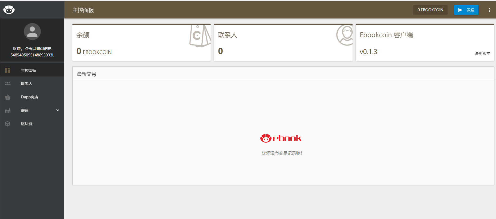

## 亿书源码阅读
亿书，英文名Ebook，是一个去中心化的出版平台，由新一代加密货币驱动，具备版权签名与认证、 协同创作、一键发布等功能，将促进人们更加主动地积累知识、分享经验，为人类创作注入新动力。

简而言之，就是一个基于js的区块链项目，我们入手来开始分析吃透这个项目。首先我们需要做的当然就是要跑通并且理解这个项目的运作流程：

我们先要成功部署这个项目才行，我们遵循[官方文档](https://github.com/Ebookcoin/ebookcoin/wiki/install)

最后我们成功跑起项目，然后在127.0.0.1:7000看到这个页面：

```
node app.js
```



接下来，我们直接从app.js开始阅读整一份源码。

### app.js

#### 0.require文件

这里首先添加了一系列的脚本配置，并且在最开头的require语句中，要注意到appConfig使用了config.json文件。

进入config文件瞧一瞧，发现里面定义了相关的诸如port，address等等的设置，还有一个很长的secret列表。

#### 1.commander的配置

开头我们便看到一通commander的配置，我们知道commander是一个nodejs的脚本辅助开源库，可以帮助我们快速写出一个脚本程序。

#### 2.异常处理的设置
process.on做全局异常处理的捕获。

#### 3.模块配置
紧接着，config对象设置了一系列对象配置的读入。主要是写明了module文件下各个模块的配置。

#### 4.模块读入
这里其实很精妙，这里用了async模块的实现。来确保模块之间的是有顺序性的。

我们来看作者给出的总结图：


如上图，同一行的模块顺序没有依赖，但是上下之间是顺序执行，也就是config模块必须加载运行完之后才会运行network模块。

所以async就是帮助你顺序并且异步的运行各个模块。

### 模块拆解分析

#### p2p网络实现
ebookcoin利用nodejs实现了一个精巧的p2p网络，详情见p2p部分的笔记。


### 参考
[Ebookcoin(亿书源码)部署文档](https://my.oschina.net/zcjlq/blog/1556985)

[官方文档](https://github.com/Ebookcoin/ebookcoin/wiki/install)
